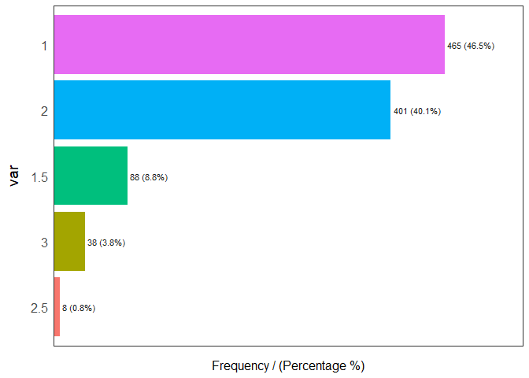
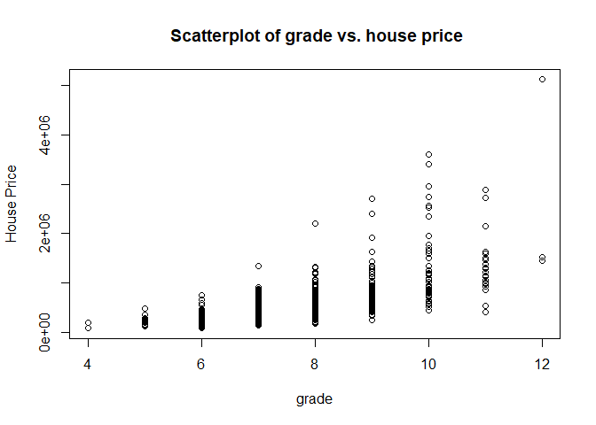
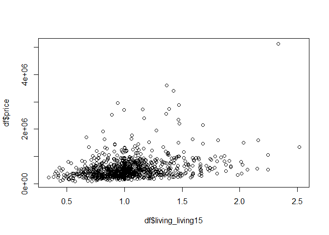

Read Data

```r
#house price data
data = read.csv("kc_house_subset.csv")
#predict the house sales in King County, Washington State, USA
#consisted of historic data of houses sold between May 2014 to May 2015. 
#understand which factors are responsible for higher property value - $650K and above
```

1. Data Description

```r
library(dplyr)
```

```
## 
## Attaching package: 'dplyr'
```

```
## The following objects are masked from 'package:stats':
## 
##     filter, lag
```

```
## The following objects are masked from 'package:base':
## 
##     intersect, setdiff, setequal, union
```

```r
dim(data)#dimension of dataset
```

```
## [1] 1000   21
```

```r
str(data)#data type for each variables
```

```
## 'data.frame':	1000 obs. of  21 variables:
##  $ id           : num  2.03e+09 7.58e+09 9.48e+09 3.34e+09 4.15e+09 ...
##  $ date         : Factor w/ 282 levels "20140502T000000",..: 55 57 186 152 160 7 182 279 214 60 ...
##  $ price        : num  265000 850000 800000 880000 660000 445000 653000 435000 230000 805000 ...
##  $ bedrooms     : int  3 3 4 5 2 2 4 3 3 2 ...
##  $ bathrooms    : num  2.5 2.25 3.5 3.5 1 2 2.5 2.5 1.5 1.75 ...
##  $ sqft_living  : int  1530 2220 2370 4600 960 1150 3120 1930 1900 1550 ...
##  $ sqft_lot     : int  6000 3707 3302 8764 6263 6634 5137 5790 9630 6000 ...
##  $ floors       : num  2 2 2 2 1 1 2 2 1 1 ...
##  $ waterfront   : int  0 0 0 0 0 0 0 0 0 0 ...
##  $ view         : int  0 0 0 0 1 0 0 0 0 1 ...
##  $ condition    : int  4 4 3 3 4 3 3 4 3 3 ...
##  $ grade        : int  7 8 8 10 6 7 7 7 8 7 ...
##  $ sqft_above   : int  1530 1620 1610 3180 960 860 3120 1930 1900 1550 ...
##  $ sqft_basement: int  0 600 760 1420 0 290 0 0 0 0 ...
##  $ yr_built     : int  1991 1919 1926 2007 1942 1940 2003 1988 1967 1920 ...
##  $ yr_renovated : int  0 0 2014 0 0 0 0 0 0 0 ...
##  $ zipcode      : int  98038 98122 98103 98006 98033 98115 98053 98011 98023 98199 ...
##  $ lat          : num  47.3 47.6 47.7 47.5 47.7 ...
##  $ long         : num  -122 -122 -122 -122 -122 ...
##  $ sqft_living15: int  1360 2030 2170 3210 1460 1680 2755 1790 2010 2360 ...
##  $ sqft_lot15   : int  6000 4850 3800 9431 6054 6892 5137 4901 9630 6000 ...
```
2.Data information

```r
library(funModeling) 
```

```
## Loading required package: Hmisc
```

```
## Loading required package: lattice
```

```
## Loading required package: survival
```

```
## Loading required package: Formula
```

```
## Loading required package: ggplot2
```

```
## 
## Attaching package: 'Hmisc'
```

```
## The following objects are masked from 'package:dplyr':
## 
##     src, summarize
```

```
## The following objects are masked from 'package:base':
## 
##     format.pval, units
```

```
## funModeling v.1.9.3 :)
## Examples and tutorials at livebook.datascienceheroes.com
##  / Now in Spanish: librovivodecienciadedatos.ai
```

```r
library(tidyverse) 
```

```
## -- Attaching packages ----------------------------------------------------- tidyverse 1.3.0 --
```

```
## v tibble  2.1.3     v purrr   0.3.3
## v tidyr   1.0.0     v stringr 1.4.0
## v readr   1.3.1     v forcats 0.4.0
```

```
## Warning: package 'purrr' was built under R version 3.6.3
```

```
## -- Conflicts -------------------------------------------------------- tidyverse_conflicts() --
## x dplyr::filter()    masks stats::filter()
## x dplyr::lag()       masks stats::lag()
## x Hmisc::src()       masks dplyr::src()
## x Hmisc::summarize() masks dplyr::summarize()
```

```r
library(Hmisc)
df <-data[,-c(1)]#exclude id
data_stats <- df_status(data)#check data unique, non-zeros, zeros, type and NA values.
```

```
##         variable q_zeros p_zeros q_na p_na q_inf p_inf    type unique
## 1             id       0     0.0    0    0     0     0 numeric   1000
## 2           date       0     0.0    0    0     0     0  factor    282
## 3          price       0     0.0    0    0     0     0 numeric    614
## 4       bedrooms       1     0.1    0    0     0     0 integer      9
## 5      bathrooms       1     0.1    0    0     0     0 numeric     18
## 6    sqft_living       0     0.0    0    0     0     0 integer    351
## 7       sqft_lot       0     0.0    0    0     0     0 integer    809
## 8         floors       0     0.0    0    0     0     0 numeric      5
## 9     waterfront     986    98.6    0    0     0     0 integer      2
## 10          view     893    89.3    0    0     0     0 integer      5
## 11     condition       0     0.0    0    0     0     0 integer      4
## 12         grade       0     0.0    0    0     0     0 integer      9
## 13    sqft_above       0     0.0    0    0     0     0 integer    319
## 14 sqft_basement     620    62.0    0    0     0     0 integer    137
## 15      yr_built       0     0.0    0    0     0     0 integer    113
## 16  yr_renovated     953    95.3    0    0     0     0 integer     30
## 17       zipcode       0     0.0    0    0     0     0 integer     70
## 18           lat       0     0.0    0    0     0     0 numeric    888
## 19          long       0     0.0    0    0     0     0 numeric    396
## 20 sqft_living15       0     0.0    0    0     0     0 integer    283
## 21    sqft_lot15       0     0.0    0    0     0     0 integer    799
```

```r
arrange(data_stats, -p_zeros) %>% select(variable, q_zeros, p_zeros)# order data by percentages of zeros
```

```
##         variable q_zeros p_zeros
## 1     waterfront     986    98.6
## 2   yr_renovated     953    95.3
## 3           view     893    89.3
## 4  sqft_basement     620    62.0
## 5       bedrooms       1     0.1
## 6      bathrooms       1     0.1
## 7             id       0     0.0
## 8           date       0     0.0
## 9          price       0     0.0
## 10   sqft_living       0     0.0
## 11      sqft_lot       0     0.0
## 12        floors       0     0.0
## 13     condition       0     0.0
## 14         grade       0     0.0
## 15    sqft_above       0     0.0
## 16      yr_built       0     0.0
## 17       zipcode       0     0.0
## 18           lat       0     0.0
## 19          long       0     0.0
## 20 sqft_living15       0     0.0
## 21    sqft_lot15       0     0.0
```

Waterfront can be categorical variable.

```r
# high carinality variables
#one in which it can take many different values
arrange(data_stats, unique) %>%select(variable, unique)# frequency of lowest rank of variable
```

```
##         variable unique
## 1     waterfront      2
## 2      condition      4
## 3         floors      5
## 4           view      5
## 5       bedrooms      9
## 6          grade      9
## 7      bathrooms     18
## 8   yr_renovated     30
## 9        zipcode     70
## 10      yr_built    113
## 11 sqft_basement    137
## 12          date    282
## 13 sqft_living15    283
## 14    sqft_above    319
## 15   sqft_living    351
## 16          long    396
## 17         price    614
## 18    sqft_lot15    799
## 19      sqft_lot    809
## 20           lat    888
## 21            id   1000
```

```r
# frequency of continous variables
freq(df$bedrooms)
```

<!-- -->

```
##   var frequency percentage cumulative_perc
## 1   3       449       44.9            44.9
## 2   4       320       32.0            76.9
## 3   2       124       12.4            89.3
## 4   5        86        8.6            97.9
## 5   1         9        0.9            98.8
## 6   6         9        0.9            99.7
## 7   0         1        0.1            99.8
## 8   7         1        0.1            99.9
## 9   9         1        0.1           100.0
```

```r
freq(df$grade)
```

<!-- -->

```
##   var frequency percentage cumulative_perc
## 1   7       388       38.8            38.8
## 2   8       307       30.7            69.5
## 3   9       122       12.2            81.7
## 4   6        85        8.5            90.2
## 5  10        54        5.4            95.6
## 6  11        24        2.4            98.0
## 7   5        14        1.4            99.4
## 8  12         4        0.4            99.8
## 9   4         2        0.2           100.0
```

```r
freq(df$floors)
```

<!-- -->

```
##   var frequency percentage cumulative_perc
## 1   1       465       46.5            46.5
## 2   2       401       40.1            86.6
## 3 1.5        88        8.8            95.4
## 4   3        38        3.8            99.2
## 5 2.5         8        0.8           100.0
```

```r
freq(df$view)
```

<!-- -->

```
##   var frequency percentage cumulative_perc
## 1   0       893       89.3            89.3
## 2   2        43        4.3            93.6
## 3   3        31        3.1            96.7
## 4   4        20        2.0            98.7
## 5   1        13        1.3           100.0
```

```r
freq(df$condition)
```

<!-- -->

```
##   var frequency percentage cumulative_perc
## 1   3       667       66.7            66.7
## 2   4       267       26.7            93.4
## 3   5        56        5.6            99.0
## 4   2        10        1.0           100.0
```

```r
freq(df$waterfront)
```

<!-- -->

```
##   var frequency percentage cumulative_perc
## 1   0       986       98.6            98.6
## 2   1        14        1.4           100.0
```

```r
freq(df$bathrooms)
```

<!-- -->

```
##     var frequency percentage cumulative_perc
## 1   2.5       251       25.1            25.1
## 2     1       172       17.2            42.3
## 3  1.75       144       14.4            56.7
## 4  2.25        94        9.4            66.1
## 5     2        85        8.5            74.6
## 6  2.75        65        6.5            81.1
## 7   1.5        58        5.8            86.9
## 8     3        35        3.5            90.4
## 9   3.5        35        3.5            93.9
## 10 3.25        31        3.1            97.0
## 11    4         9        0.9            97.9
## 12 3.75         6        0.6            98.5
## 13 4.25         5        0.5            99.0
## 14  4.5         5        0.5            99.5
## 15 0.75         2        0.2            99.7
## 16    0         1        0.1            99.8
## 17 5.25         1        0.1            99.9
## 18  5.5         1        0.1           100.0
```

3.Data Prepocessing and Feature Construction
3.1 Handle variable"date" format

```r
df$date = substr(df$date, 1, 6)
# Converting it to numeric as we can only use numeric values for corrleation
df$date = as.numeric(as.character(df$date))
```

3.2 Add new feature age and renov_ag

```r
last_renew<-1:nrow(df)
index =1
df$start = substr(df$date, 1, 4)
df$age<-as.numeric(as.character(df$start))-df$yr_built
for (i in df$yr_renovated){
  #print(i)
  if (i != 0){
     # print(inedx)
      last_renew[index]=as.numeric(df$start)[index]-i
  }
  else{last_renew[index]=0}
  index=index+1
}
df$renov_age<-last_renew
#drop yr_built, y_renovated, start, date
drop <- c("date","start","yr_renovated","yr_built")
df<-df[!(names(df) %in% drop)]
```

3.3 Remove rows which bathroom ==0 and bedroom ==0

```r
df <-df[df$bathrooms > 0,]
df <-df[df$bedrooms > 0,]
```

3.4  add dummy variables for zipcode

```r
zip_ = factor(df$zipcode)
dummies = model.matrix(~zip_)
df <-cbind(df,dummies[,-c(1)])
#drop zipcode
drop <- c("zipcode")
df<-df[!(names(df) %in% drop)]
```

3.5 add new feature distance to center

```r
new<-paste(df$lat,sep=",",df$long)
distance <-1:nrow(df)
dist_to_center <- function (lat1, lon1, lat2, lon2)
{   
    lon2 <- lon2*pi/180;
    lat2 <- lat2*pi/180;
    lon1 <- lon1*pi/180;
    lat1 <- lat1*pi/180;
    dlon <- lon2 - lon1
    dlat<- lat2 - lat1
    a <- sin(dlat/2)^2 + cos(lat1) * cos(lat2) * sin(dlon/2)^2
    c <- 2 * atan2( sqrt(a), sqrt(1-a) ) 
    d <- 3961 * c;
} 
#print(dist_to_center(47.3487,-122.036,47.6062, 122.3321))      
for (i in 1:nrow(df)){
   distance[i]<-dist_to_center(df$long[i],df$lat[i], -122.200676,47.610378)*1.6
}
df$distance_to_center<-distance
# drop lat and long
drop <- c("lat","long")
df<-df[!(names(df) %in% drop)]
head(df)
```

```
##    price bedrooms bathrooms sqft_living sqft_lot floors waterfront view
## 1 265000        3      2.50        1530     6000      2          0    0
## 2 850000        3      2.25        2220     3707      2          0    0
## 3 800000        4      3.50        2370     3302      2          0    0
## 4 880000        5      3.50        4600     8764      2          0    0
## 5 660000        2      1.00         960     6263      1          0    1
## 6 445000        2      2.00        1150     6634      1          0    0
##   condition grade sqft_above sqft_basement sqft_living15 sqft_lot15 age
## 1         4     7       1530             0          1360       6000  23
## 2         4     8       1620           600          2030       4850  95
## 3         3     8       1610           760          2170       3800  89
## 4         3    10       3180          1420          3210       9431   7
## 5         4     6        960             0          1460       6054  72
## 6         3     7        860           290          1680       6892  74
##   renov_age zip_98002 zip_98003 zip_98004 zip_98005 zip_98006 zip_98007
## 1         0         0         0         0         0         0         0
## 2         0         0         0         0         0         0         0
## 3         1         0         0         0         0         0         0
## 4         0         0         0         0         0         1         0
## 5         0         0         0         0         0         0         0
## 6         0         0         0         0         0         0         0
##   zip_98008 zip_98010 zip_98011 zip_98014 zip_98019 zip_98022 zip_98023
## 1         0         0         0         0         0         0         0
## 2         0         0         0         0         0         0         0
## 3         0         0         0         0         0         0         0
## 4         0         0         0         0         0         0         0
## 5         0         0         0         0         0         0         0
## 6         0         0         0         0         0         0         0
##   zip_98024 zip_98027 zip_98028 zip_98029 zip_98030 zip_98031 zip_98032
## 1         0         0         0         0         0         0         0
## 2         0         0         0         0         0         0         0
## 3         0         0         0         0         0         0         0
## 4         0         0         0         0         0         0         0
## 5         0         0         0         0         0         0         0
## 6         0         0         0         0         0         0         0
##   zip_98033 zip_98034 zip_98038 zip_98039 zip_98040 zip_98042 zip_98045
## 1         0         0         1         0         0         0         0
## 2         0         0         0         0         0         0         0
## 3         0         0         0         0         0         0         0
## 4         0         0         0         0         0         0         0
## 5         1         0         0         0         0         0         0
## 6         0         0         0         0         0         0         0
##   zip_98052 zip_98053 zip_98055 zip_98056 zip_98058 zip_98059 zip_98065
## 1         0         0         0         0         0         0         0
## 2         0         0         0         0         0         0         0
## 3         0         0         0         0         0         0         0
## 4         0         0         0         0         0         0         0
## 5         0         0         0         0         0         0         0
## 6         0         0         0         0         0         0         0
##   zip_98070 zip_98072 zip_98074 zip_98075 zip_98077 zip_98092 zip_98102
## 1         0         0         0         0         0         0         0
## 2         0         0         0         0         0         0         0
## 3         0         0         0         0         0         0         0
## 4         0         0         0         0         0         0         0
## 5         0         0         0         0         0         0         0
## 6         0         0         0         0         0         0         0
##   zip_98103 zip_98105 zip_98106 zip_98107 zip_98108 zip_98109 zip_98112
## 1         0         0         0         0         0         0         0
## 2         0         0         0         0         0         0         0
## 3         1         0         0         0         0         0         0
## 4         0         0         0         0         0         0         0
## 5         0         0         0         0         0         0         0
## 6         0         0         0         0         0         0         0
##   zip_98115 zip_98116 zip_98117 zip_98118 zip_98119 zip_98122 zip_98125
## 1         0         0         0         0         0         0         0
## 2         0         0         0         0         0         1         0
## 3         0         0         0         0         0         0         0
## 4         0         0         0         0         0         0         0
## 5         0         0         0         0         0         0         0
## 6         1         0         0         0         0         0         0
##   zip_98126 zip_98133 zip_98136 zip_98144 zip_98146 zip_98148 zip_98155
## 1         0         0         0         0         0         0         0
## 2         0         0         0         0         0         0         0
## 3         0         0         0         0         0         0         0
## 4         0         0         0         0         0         0         0
## 5         0         0         0         0         0         0         0
## 6         0         0         0         0         0         0         0
##   zip_98166 zip_98168 zip_98177 zip_98178 zip_98188 zip_98198 zip_98199
## 1         0         0         0         0         0         0         0
## 2         0         0         0         0         0         0         0
## 3         0         0         0         0         0         0         0
## 4         0         0         0         0         0         0         0
## 5         0         0         0         0         0         0         0
## 6         0         0         0         0         0         0         0
##   distance_to_center
## 1          23.845585
## 2           9.445944
## 3          16.119005
## 4           3.799580
## 5           3.199452
## 6          13.100354
```

3.6 add new feature bed to bath ratio

```r
bed_to_bath<-df$bedrooms/df$bathrooms
df<-cbind(df,bed_to_bath)
```

3.7 add new feature ratio between the square footage of the interior living space and the land lot

```r
living_to_lot<-df$sqft_living/df$sqft_lot
df<-cbind(df,living_to_lot)
```

3.8 add new feature the price per square footage

```r
price_per_sqrt<-df$price/df$sqft_lot
df<-cbind(df,price_per_sqrt)
```

3.9 add new feature the price per interior living space 

```r
price_per_interior<-df$price/df$sqft_living
df<-cbind(df,price_per_interior)
```

3.10 add new feature the price per floor

```r
price_per_floor<-df$price/df$floors
df<-cbind(df,price_per_floor)
```

3.11 add new feature Ratio between floors and land

```r
floors_to_land<-df$floors/df$sqft_lot
df<-cbind(df,floors_to_land)
```

3.12 add new feature Ratio of house living space to nearest 15 houses

```r
living_living15<-df$sqft_living/df$sqft_living15
df<-cbind(df,living_living15)
```

3.13 add new feature Ratio of land lot to nearest 15 houses

```r
lot_lot15<-df$sqft_lot/df$sqft_lot15
df<-cbind(df,lot_lot15)
```

3.14 add new feature bed to sqft_living 

```r
bed_living<-df$bedrooms/df$sqft_living
df<-cbind(df,bed_living)
```

3.15 add new feature price per bedroom 

```r
price_bed<-df$price/df$bedrooms
df<-cbind(df,price_bed)
```

3.16 add new feature bed to floor 

```r
bed_floor<-df$bedrooms/df$floors
df<-cbind(df,bed_floor)
```

3.17 add new feature bed to land

```r
bed_land<-df$bedrooms/df$sqft_lot
df<-cbind(df,bed_land)
```

3.18 add new feature price per bathrooms

```r
price_per_bathroom<-df$price/df$bathrooms
df<-cbind(df,price_per_bathroom)
```

3.19 add new feature price per condition 

```r
price_per_condition<-df$price/df$condition
df<-cbind(df,price_per_condition)
```

3.20 add new feature price per grade 

```r
price_per_grade<-df$price/df$grade
df<-cbind(df,price_per_grade)
```

3.21 add new feature price per sqft_above

```r
price_per_sqftabove<-df$price/df$sqft_above
df<-cbind(df,price_per_sqftabove)
```

3.22 add new feature price per distance from centre 

```r
price_per_dist<-df$price/df$distance_to_center
df<-cbind(df,price_per_dist)
```

3.23 add new feature bathroom to sqft_living

```r
bathroom_to_sqft_living<-df$bedrooms/df$sqft_living
df<-cbind(df,bathroom_to_sqft_living)
```

3.24 add new feature bathroom to floors 

```r
bathroom_to_floors<-df$bathrooms/df$floors
df<-cbind(df,bathroom_to_floors)
```

3.25 add new feature sqftliving_floots

```r
sqftliving_floors<-df$sqft_living/df$floors
df<-cbind(df,sqftliving_floors)
```

3.26 add new feature sqftliving_sqftabove

```r
sqftliving_sqftabove<-df$sqft_living/df$sqft_above
df<-cbind(df,sqftliving_sqftabove)
```

3.27 add new feature age_dif_renovate

```r
age_dif_renovate<-df$age-df$renov_age
df<-cbind(df,age_dif_renovate)
```


4. Exploratory Data Analysis
4.1 Pairplots among all variables

```r
pairs(price~bedrooms+bathrooms+sqft_living+floors,data = df,col = "blue",pch = 16)
```

<!-- -->

```r
pairs(price~sqft_lot+sqft_above+sqft_basement+sqft_living+sqft_living15+sqft_lot15,data = df,col = "blue",pch = 16)
```

<!-- -->

```r
pairs(price~waterfront+condition+view+grade,data = df,col = "blue",pch = 16)#categorical variables
```

<!-- -->

4.2 Analyze response variable - house price distribution

```r
#install.packages("ggpubr")
library(ggpubr)
```

```
## Loading required package: magrittr
```

```
## 
## Attaching package: 'magrittr'
```

```
## The following object is masked from 'package:purrr':
## 
##     set_names
```

```
## The following object is masked from 'package:tidyr':
## 
##     extract
```

```r
# Basic density plot with mean line and marginal rug
a <- ggplot(df, aes(x = price))
a + geom_histogram(aes(y = ..density..), 
                   colour="black", fill="white",bins=30) +
  geom_density(alpha = 0.2, fill = "#FF6666") 
```

<!-- -->

```r
boxplot(df$price)
```

<!-- -->

4.3 Analyze how age and yr_renew of houses vs. price

```r
plot(df$price~df$age)
```

<!-- -->

```r
plot(df$price~df$renov_age)
```

<!-- -->

4.4 Find bathrooms relation with house price

```r
price_bath<- select(df,price,bathrooms)
boxplot(price_bath$price~price_bath$bathrooms,xlab="bathrooms",ylab="House Price",main="bathrooms vs. house price",col = "blue")
```

<!-- -->

4.5 Find how sqft_living related to house price

```r
price_area<- select(df,price,sqft_living)
plot(price_area$price~price_area$sqft_living,xlab="sqft_living",ylab="House Price",main="sqft_living vs. house price",pch =16,col ="blue")
```

<!-- -->

4.6 Find how sqft_above related to house price

```r
price_above<- select(df,price,sqft_above)
plot(price_above$price~price_above$sqft_above,xlab="sqft_above",ylab="House Price",main="sqft_above vs. house price",pch=16,col ="blue")
```

<!-- -->

4.7 Find how sqft_basement related to house price

```r
price_above<- select(df,price,sqft_basement)
plot(price_above$price~price_above$sqft_basement,xlab="sqft_basement",ylab="House Price",main="sqft_basement vs. house price",pch=16,col ="blue")
```

<!-- -->

4.8 Find how sqft_living15 related to house price

```r
price_sqft15<- select(df,price,sqft_living15)
plot(price_sqft15$price~price_sqft15$sqft_living15,xlab="sqft_living",ylab="House Price",main="sqft_living15 vs. house price",pch=16,col ="blue")
```

<!-- -->

4.9 lat and long to center

```r
plot(df$price~df$distance_to_center)
```

<!-- -->

```r
#min(df$distance_to_center)
#max(df$distance_to_center)
#df
```

4.10 Find how grade affects the house price

```r
price_grade<- select(df,price,grade)
boxplot(price_grade$price~price_grade$grade,xlab="grade",ylab="House Price",main="grade vs. house price",col =c("yellow","lightyellow","blue","red","green","orange","purple","pink","grey") ,border = "brown")
abline(h =mean(price_grade$price),col="red",lwd=3, lty=2)
```

<!-- -->

```r
plot(price_grade$price~price_grade$grade,xlab="grade",ylab="House Price",main=" Scatterplot of grade vs. house price")
```

<!-- -->

4.11 Find relationship with View and price

```r
price_view<- select(df,price,view)
boxplot(price_view$price~price_view$view,xlab="view",ylab="House Price",main="view vs. house price",col = "blue")
```

<!-- -->

```r
plot(price_view$price~price_view$view,xlab="view",ylab="House Price",main="Scatterplot of view vs. house price")
```

<!-- -->

4.12 Find relationship with condition and price

```r
price_condition<- select(df,price,condition)
boxplot(price_condition$price~price_condition$condition,xlab="condition",ylab="House Price",main="condition vs. house price",col = "blue")
```

<!-- -->

```r
plot(price_condition$price~price_condition$condition,xlab="condition",ylab="House Price",main=" Scatterplot of condition vs. house price")
```

<!-- -->
4.13 Find relationship with waterfront and price

```r
price_waterfront<- select(df,price,waterfront)
boxplot(price_waterfront$price~price_waterfront$waterfront,xlab="waterfront",ylab="House Price",main="waterfront vs. house price",col = "blue")
```

<!-- -->
4.14 Find relationship with floors and price

```r
price_floors<- select(df,price,floors)
boxplot(price_floors$price~price_floors$floors,xlab="floors",ylab="House Price",main="floors vs. house price",pch =16,col ="blue")
```

<!-- -->

4.15 Find relationship with price and bed_to_bath

```r
plot(df$price~df$bed_to_bath)
```

<!-- -->
4.16 Find relationship with price and living_to_lot

```r
plot(df$price~df$living_to_lot)
```

<!-- -->
4.17 Find relationship with price and price/sqrt,price/interior,price_per_floor, price/sqft_above,price_per_dist

```r
plot(df$price~df$price_per_sqrt)
```

<!-- -->

```r
plot(df$price~df$price_per_interior)
```

<!-- -->

```r
plot(df$price~df$price_per_floor)
```

<!-- -->

```r
plot(df$price~df$price_per_sqftabove)
```

<!-- -->

```r
plot(df$price~df$price_per_dist)
```

<!-- -->

4.18 Find relationship with price and price/bed,price/bathroom,price/condtion,price/grade, 

```r
plot(df$price~df$price_per_bathroom)
```

<!-- -->

```r
plot(df$price~df$price_bed)
```

<!-- -->

```r
plot(df$price~df$price_per_condition)
```

<!-- -->

```r
plot(df$price~df$price_per_grade)
```

<!-- -->

4.19 Find relationship with price and floors_to_land,living_living15,lot_lot15,bed_living,bed_land,bed_floor,bathroom_to_floors,sqftliving_floots,sqftliving_sqftabove

```r
plot(df$price~df$floors_to_land)
```

<!-- -->

```r
plot(df$price~df$living_living15)
```

<!-- -->

```r
plot(df$price~df$lot_lot15)
```

<!-- -->

```r
plot(df$price~df$bed_living)
```

<!-- -->

```r
plot(df$price~df$bed_land)
```

<!-- -->

```r
plot(df$price~df$bed_floor)
```

<!-- -->

```r
plot(df$price~df$bathroom_to_floors)
```

<!-- -->

```r
plot(df$price~df$sqftliving_floors)
```

<!-- -->

```r
plot(df$price~df$sqftliving_sqftabove)
```

<!-- -->

```r
plot(df$price~df$age_dif_renovate)
```

<!-- -->


```r
df_new<-df[-c(17:85)]#drop zipcode...
#df_new
#information about continuous variables, including quantiles, mean, median, count, missing values.
exclude_ <-c("waterfront")
exclude_df<-df[ , !(names(df) %in% exclude_)]
describe(exclude_df)
```

```
## exclude_df 
## 
##  107  Variables      999  Observations
## --------------------------------------------------------------------------------
## price 
##        n  missing distinct     Info     Mean      Gmd      .05      .10 
##      999        0      614        1   559804   349503   210675   250000 
##      .25      .50      .75      .90      .95 
##   330000   462000   660000   920300  1185000 
## 
## lowest :   90000  100000  110000  122000  135000
## highest: 2890000 2950000 3400000 3600000 5110800
## --------------------------------------------------------------------------------
## bedrooms 
##        n  missing distinct     Info     Mean      Gmd 
##      999        0        8    0.874    3.387   0.9411 
## 
## lowest : 1 2 3 4 5, highest: 4 5 6 7 9
##                                                           
## Value          1     2     3     4     5     6     7     9
## Frequency      9   124   449   320    86     9     1     1
## Proportion 0.009 0.124 0.449 0.320 0.086 0.009 0.001 0.001
## --------------------------------------------------------------------------------
## bathrooms 
##        n  missing distinct     Info     Mean      Gmd      .05      .10 
##      999        0       17    0.974    2.144   0.8414     1.00     1.00 
##      .25      .50      .75      .90      .95 
##     1.75     2.25     2.50     3.00     3.50 
## 
## lowest : 0.75 1.00 1.50 1.75 2.00, highest: 4.00 4.25 4.50 5.25 5.50
##                                                                             
## Value       0.75  1.00  1.50  1.75  2.00  2.25  2.50  2.75  3.00  3.25  3.50
## Frequency      2   172    58   144    85    94   251    65    35    31    35
## Proportion 0.002 0.172 0.058 0.144 0.085 0.094 0.251 0.065 0.035 0.031 0.035
##                                               
## Value       3.75  4.00  4.25  4.50  5.25  5.50
## Frequency      6     9     5     5     1     1
## Proportion 0.006 0.009 0.005 0.005 0.001 0.001
## --------------------------------------------------------------------------------
## sqft_living 
##        n  missing distinct     Info     Mean      Gmd      .05      .10 
##      999        0      351        1     2115     1008      960     1120 
##      .25      .50      .75      .90      .95 
##     1420     1930     2630     3290     3907 
## 
## lowest :  560  580  600  640  670, highest: 5635 5710 5780 5850 8010
## --------------------------------------------------------------------------------
## sqft_lot 
##        n  missing distinct     Info     Mean      Gmd      .05      .10 
##      999        0      809        1    14551    17085     1637     3267 
##      .25      .50      .75      .90      .95 
##     5000     7538    10412    21967    41680 
## 
## lowest :    811    812    826    889    892, highest: 284011 288367 313672 383328 426450
## --------------------------------------------------------------------------------
## floors 
##        n  missing distinct     Info     Mean      Gmd 
##      999        0        5    0.834    1.533    0.577 
## 
## lowest : 1.0 1.5 2.0 2.5 3.0, highest: 1.0 1.5 2.0 2.5 3.0
##                                         
## Value        1.0   1.5   2.0   2.5   3.0
## Frequency    465    88   400     8    38
## Proportion 0.465 0.088 0.400 0.008 0.038
## --------------------------------------------------------------------------------
## view 
##        n  missing distinct     Info     Mean      Gmd 
##      999        0        5    0.288   0.2723   0.4984 
## 
## lowest : 0 1 2 3 4, highest: 0 1 2 3 4
##                                         
## Value          0     1     2     3     4
## Frequency    892    13    43    31    20
## Proportion 0.893 0.013 0.043 0.031 0.020
## --------------------------------------------------------------------------------
## condition 
##        n  missing distinct     Info     Mean      Gmd 
##      999        0        4    0.684    3.369   0.5638 
##                                   
## Value          2     3     4     5
## Frequency     10   666   267    56
## Proportion 0.010 0.667 0.267 0.056
## --------------------------------------------------------------------------------
## grade 
##        n  missing distinct     Info     Mean      Gmd 
##      999        0        9     0.91    7.711    1.256 
## 
## lowest :  4  5  6  7  8, highest:  8  9 10 11 12
##                                                                 
## Value          4     5     6     7     8     9    10    11    12
## Frequency      2    14    85   387   307   122    54    24     4
## Proportion 0.002 0.014 0.085 0.387 0.307 0.122 0.054 0.024 0.004
## --------------------------------------------------------------------------------
## sqft_above 
##        n  missing distinct     Info     Mean      Gmd      .05      .10 
##      999        0      319        1     1832    903.7      879      988 
##      .25      .50      .75      .90      .95 
##     1210     1600     2320     3032     3474 
## 
## lowest :  560  580  590  600  640, highest: 4670 4740 5060 5710 5990
## --------------------------------------------------------------------------------
## sqft_basement 
##        n  missing distinct     Info     Mean      Gmd      .05      .10 
##      999        0      137    0.762    283.5    415.5        0        0 
##      .25      .50      .75      .90      .95 
##        0        0      570      990     1190 
## 
## lowest :    0   40   50   60   80, highest: 1780 1790 1820 2020 2090
## --------------------------------------------------------------------------------
## sqft_living15 
##        n  missing distinct     Info     Mean      Gmd      .05      .10 
##      999        0      283        1     2026    754.5     1169     1270 
##      .25      .50      .75      .90      .95 
##     1510     1870     2420     2980     3303 
## 
## lowest :  950  970  980  990 1000, highest: 4400 4770 4800 4830 5170
## --------------------------------------------------------------------------------
## sqft_lot15 
##        n  missing distinct     Info     Mean      Gmd      .05      .10 
##      999        0      799        1    11987    12119     1694     3663 
##      .25      .50      .75      .90      .95 
##     5004     7595     9839    17270    35584 
## 
## lowest :    824    942    977   1007   1030, highest: 213444 217800 220654 232230 297514
## --------------------------------------------------------------------------------
## age 
##        n  missing distinct     Info     Mean      Gmd      .05      .10 
##      999        0      112        1    42.19     33.8      2.0      7.0 
##      .25      .50      .75      .90      .95 
##     15.0     38.0     62.0     87.2    100.0 
## 
## lowest :   0   1   2   3   4, highest: 109 110 111 113 114
## --------------------------------------------------------------------------------
## renov_age 
##        n  missing distinct     Info     Mean      Gmd      .05      .10 
##      999        0       28    0.121   0.8949    1.743        0        0 
##      .25      .50      .75      .90      .95 
##        0        0        0        0        0 
## 
## lowest :  0  1  2  5  6, highest: 34 43 49 51 69
## --------------------------------------------------------------------------------
## zip_98002 
##        n  missing distinct     Info      Sum     Mean      Gmd 
##      999        0        2    0.033       11  0.01101   0.0218 
## 
## --------------------------------------------------------------------------------
## zip_98003 
##        n  missing distinct     Info      Sum     Mean      Gmd 
##      999        0        2    0.027        9 0.009009  0.01787 
## 
## --------------------------------------------------------------------------------
## zip_98004 
##        n  missing distinct     Info      Sum     Mean      Gmd 
##      999        0        2    0.044       15  0.01502  0.02961 
## 
## --------------------------------------------------------------------------------
## zip_98005 
##        n  missing distinct     Info      Sum     Mean      Gmd 
##      999        0        2    0.027        9 0.009009  0.01787 
## 
## --------------------------------------------------------------------------------
## zip_98006 
##        n  missing distinct     Info      Sum     Mean      Gmd 
##      999        0        2    0.065       22  0.02202  0.04312 
## 
## --------------------------------------------------------------------------------
## zip_98007 
##        n  missing distinct     Info      Sum     Mean      Gmd 
##      999        0        2    0.012        4 0.004004 0.007984 
## 
## --------------------------------------------------------------------------------
## zip_98008 
##        n  missing distinct     Info      Sum     Mean      Gmd 
##      999        0        2    0.039       13  0.01301  0.02571 
## 
## --------------------------------------------------------------------------------
## zip_98010 
##        n  missing distinct     Info      Sum     Mean      Gmd 
##      999        0        2    0.027        9 0.009009  0.01787 
## 
## --------------------------------------------------------------------------------
## zip_98011 
##        n  missing distinct     Info      Sum     Mean      Gmd 
##      999        0        2    0.039       13  0.01301  0.02571 
## 
## --------------------------------------------------------------------------------
## zip_98014 
##        n  missing distinct     Info      Sum     Mean      Gmd 
##      999        0        2    0.024        8 0.008008   0.0159 
## 
## --------------------------------------------------------------------------------
## zip_98019 
##        n  missing distinct     Info      Sum     Mean      Gmd 
##      999        0        2    0.021        7 0.007007  0.01393 
## 
## --------------------------------------------------------------------------------
## zip_98022 
##        n  missing distinct     Info      Sum     Mean      Gmd 
##      999        0        2    0.024        8 0.008008   0.0159 
## 
## --------------------------------------------------------------------------------
## zip_98023 
##        n  missing distinct     Info      Sum     Mean      Gmd 
##      999        0        2    0.065       22  0.02202  0.04312 
## 
## --------------------------------------------------------------------------------
## zip_98024 
##        n  missing distinct     Info      Sum     Mean      Gmd 
##      999        0        2    0.018        6 0.006006  0.01195 
## 
## --------------------------------------------------------------------------------
## zip_98027 
##        n  missing distinct     Info      Sum     Mean      Gmd 
##      999        0        2    0.044       15  0.01502  0.02961 
## 
## --------------------------------------------------------------------------------
## zip_98028 
##        n  missing distinct     Info      Sum     Mean      Gmd 
##      999        0        2    0.027        9 0.009009  0.01787 
## 
## --------------------------------------------------------------------------------
## zip_98029 
##        n  missing distinct     Info      Sum     Mean      Gmd 
##      999        0        2    0.047       16  0.01602  0.03155 
## 
## --------------------------------------------------------------------------------
## zip_98030 
##        n  missing distinct     Info      Sum     Mean      Gmd 
##      999        0        2    0.039       13  0.01301  0.02571 
## 
## --------------------------------------------------------------------------------
## zip_98031 
##        n  missing distinct     Info      Sum     Mean      Gmd 
##      999        0        2    0.036       12  0.01201  0.02376 
## 
## --------------------------------------------------------------------------------
## zip_98032 
##        n  missing distinct     Info      Sum     Mean      Gmd 
##      999        0        2    0.027        9 0.009009  0.01787 
## 
## --------------------------------------------------------------------------------
## zip_98033 
##        n  missing distinct     Info      Sum     Mean      Gmd 
##      999        0        2    0.076       26  0.02603  0.05075 
## 
## --------------------------------------------------------------------------------
## zip_98034 
##        n  missing distinct     Info      Sum     Mean      Gmd 
##      999        0        2    0.065       22  0.02202  0.04312 
## 
## --------------------------------------------------------------------------------
## zip_98038 
##        n  missing distinct     Info      Sum     Mean      Gmd 
##      999        0        2    0.076       26  0.02603  0.05075 
## 
## --------------------------------------------------------------------------------
## zip_98039 
##        n  missing distinct     Info      Sum     Mean      Gmd 
##      999        0        2    0.009        3 0.003003 0.005994 
## 
## --------------------------------------------------------------------------------
## zip_98040 
##        n  missing distinct     Info      Sum     Mean      Gmd 
##      999        0        2    0.024        8 0.008008   0.0159 
## 
## --------------------------------------------------------------------------------
## zip_98042 
##        n  missing distinct     Info      Sum     Mean      Gmd 
##      999        0        2    0.062       21  0.02102   0.0412 
## 
## --------------------------------------------------------------------------------
## zip_98045 
##        n  missing distinct     Info      Sum     Mean      Gmd 
##      999        0        2    0.024        8 0.008008   0.0159 
## 
## --------------------------------------------------------------------------------
## zip_98052 
##        n  missing distinct     Info      Sum     Mean      Gmd 
##      999        0        2    0.101       35  0.03504  0.06768 
## 
## --------------------------------------------------------------------------------
## zip_98053 
##        n  missing distinct     Info      Sum     Mean      Gmd 
##      999        0        2    0.047       16  0.01602  0.03155 
## 
## --------------------------------------------------------------------------------
## zip_98055 
##        n  missing distinct     Info      Sum     Mean      Gmd 
##      999        0        2    0.047       16  0.01602  0.03155 
## 
## --------------------------------------------------------------------------------
## zip_98056 
##        n  missing distinct     Info      Sum     Mean      Gmd 
##      999        0        2    0.062       21  0.02102   0.0412 
## 
## --------------------------------------------------------------------------------
## zip_98058 
##        n  missing distinct     Info      Sum     Mean      Gmd 
##      999        0        2    0.059       20  0.02002  0.03928 
## 
## --------------------------------------------------------------------------------
## zip_98059 
##        n  missing distinct     Info      Sum     Mean      Gmd 
##      999        0        2    0.073       25  0.02503  0.04885 
## 
## --------------------------------------------------------------------------------
## zip_98065 
##        n  missing distinct     Info      Sum     Mean      Gmd 
##      999        0        2    0.056       19  0.01902  0.03735 
## 
## --------------------------------------------------------------------------------
## zip_98070 
##        n  missing distinct     Info      Sum     Mean      Gmd 
##      999        0        2    0.018        6 0.006006  0.01195 
## 
## --------------------------------------------------------------------------------
## zip_98072 
##        n  missing distinct     Info      Sum     Mean      Gmd 
##      999        0        2    0.041       14  0.01401  0.02766 
## 
## --------------------------------------------------------------------------------
## zip_98074 
##        n  missing distinct     Info      Sum     Mean      Gmd 
##      999        0        2    0.099       34  0.03403  0.06582 
## 
## --------------------------------------------------------------------------------
## zip_98075 
##        n  missing distinct     Info      Sum     Mean      Gmd 
##      999        0        2    0.021        7 0.007007  0.01393 
## 
## --------------------------------------------------------------------------------
## zip_98077 
##        n  missing distinct     Info      Sum     Mean      Gmd 
##      999        0        2    0.012        4 0.004004 0.007984 
## 
## --------------------------------------------------------------------------------
## zip_98092 
##        n  missing distinct     Info      Sum     Mean      Gmd 
##      999        0        2    0.062       21  0.02102   0.0412 
## 
## --------------------------------------------------------------------------------
## zip_98102 
##        n  missing distinct     Info      Sum     Mean      Gmd 
##      999        0        2    0.009        3 0.003003 0.005994 
## 
## --------------------------------------------------------------------------------
## zip_98103 
##        n  missing distinct     Info      Sum     Mean      Gmd 
##      999        0        2    0.082       28  0.02803  0.05454 
## 
## --------------------------------------------------------------------------------
## zip_98105 
##        n  missing distinct     Info      Sum     Mean      Gmd 
##      999        0        2    0.027        9 0.009009  0.01787 
## 
## --------------------------------------------------------------------------------
## zip_98106 
##        n  missing distinct     Info      Sum     Mean      Gmd 
##      999        0        2     0.03       10  0.01001  0.01984 
## 
## --------------------------------------------------------------------------------
## zip_98107 
##        n  missing distinct     Info      Sum     Mean      Gmd 
##      999        0        2    0.036       12  0.01201  0.02376 
## 
## --------------------------------------------------------------------------------
## zip_98108 
##        n  missing distinct     Info      Sum     Mean      Gmd 
##      999        0        2    0.027        9 0.009009  0.01787 
## 
## --------------------------------------------------------------------------------
## zip_98109 
##        n  missing distinct     Info      Sum     Mean      Gmd 
##      999        0        2    0.015        5 0.005005  0.00997 
## 
## --------------------------------------------------------------------------------
## zip_98112 
##        n  missing distinct     Info      Sum     Mean      Gmd 
##      999        0        2    0.041       14  0.01401  0.02766 
## 
## --------------------------------------------------------------------------------
## zip_98115 
##        n  missing distinct     Info      Sum     Mean      Gmd 
##      999        0        2    0.079       27  0.02703  0.05265 
## 
## --------------------------------------------------------------------------------
## zip_98116 
##        n  missing distinct     Info      Sum     Mean      Gmd 
##      999        0        2    0.036       12  0.01201  0.02376 
## 
## --------------------------------------------------------------------------------
## zip_98117 
##        n  missing distinct     Info      Sum     Mean      Gmd 
##      999        0        2    0.107       37  0.03704   0.0714 
## 
## --------------------------------------------------------------------------------
## zip_98118 
##        n  missing distinct     Info      Sum     Mean      Gmd 
##      999        0        2    0.062       21  0.02102   0.0412 
## 
## --------------------------------------------------------------------------------
## zip_98119 
##        n  missing distinct     Info      Sum     Mean      Gmd 
##      999        0        2    0.039       13  0.01301  0.02571 
## 
## --------------------------------------------------------------------------------
## zip_98122 
##        n  missing distinct     Info      Sum     Mean      Gmd 
##      999        0        2    0.036       12  0.01201  0.02376 
## 
## --------------------------------------------------------------------------------
## zip_98125 
##        n  missing distinct     Info      Sum     Mean      Gmd 
##      999        0        2    0.044       15  0.01502  0.02961 
## 
## --------------------------------------------------------------------------------
## zip_98126 
##        n  missing distinct     Info      Sum     Mean      Gmd 
##      999        0        2    0.039       13  0.01301  0.02571 
## 
## --------------------------------------------------------------------------------
## zip_98133 
##        n  missing distinct     Info      Sum     Mean      Gmd 
##      999        0        2    0.065       22  0.02202  0.04312 
## 
## --------------------------------------------------------------------------------
## zip_98136 
##        n  missing distinct     Info      Sum     Mean      Gmd 
##      999        0        2    0.033       11  0.01101   0.0218 
## 
## --------------------------------------------------------------------------------
## zip_98144 
##        n  missing distinct     Info      Sum     Mean      Gmd 
##      999        0        2    0.059       20  0.02002  0.03928 
## 
## --------------------------------------------------------------------------------
## zip_98146 
##        n  missing distinct     Info      Sum     Mean      Gmd 
##      999        0        2    0.036       12  0.01201  0.02376 
## 
## --------------------------------------------------------------------------------
## zip_98148 
##        n  missing distinct     Info      Sum     Mean      Gmd 
##      999        0        2    0.015        5 0.005005  0.00997 
## 
## --------------------------------------------------------------------------------
## zip_98155 
##        n  missing distinct     Info      Sum     Mean      Gmd 
##      999        0        2    0.047       16  0.01602  0.03155 
## 
## --------------------------------------------------------------------------------
## zip_98166 
##        n  missing distinct     Info      Sum     Mean      Gmd 
##      999        0        2     0.03       10  0.01001  0.01984 
## 
## --------------------------------------------------------------------------------
## zip_98168 
##        n  missing distinct     Info      Sum     Mean      Gmd 
##      999        0        2    0.041       14  0.01401  0.02766 
## 
## --------------------------------------------------------------------------------
## zip_98177 
##        n  missing distinct     Info      Sum     Mean      Gmd 
##      999        0        2    0.041       14  0.01401  0.02766 
## 
## --------------------------------------------------------------------------------
## zip_98178 
##        n  missing distinct     Info      Sum     Mean      Gmd 
##      999        0        2    0.021        7 0.007007  0.01393 
## 
## --------------------------------------------------------------------------------
## zip_98188 
##        n  missing distinct     Info      Sum     Mean      Gmd 
##      999        0        2    0.024        8 0.008008   0.0159 
## 
## --------------------------------------------------------------------------------
## zip_98198 
##        n  missing distinct     Info      Sum     Mean      Gmd 
##      999        0        2     0.03       10  0.01001  0.01984 
## 
## --------------------------------------------------------------------------------
## zip_98199 
##        n  missing distinct     Info      Sum     Mean      Gmd 
##      999        0        2    0.033       11  0.01101   0.0218 
## 
## --------------------------------------------------------------------------------
## distance_to_center 
##        n  missing distinct     Info     Mean      Gmd      .05      .10 
##      999        0      997        1    15.81    8.513    4.898    6.838 
##      .25      .50      .75      .90      .95 
##   10.081   15.659   19.981   23.733   31.259 
## 
## lowest :  0.6481039  0.8403774  0.8834340  1.0937628  1.1663135
## highest: 48.6569797 50.2950222 50.8657566 53.6894193 54.3398516
## --------------------------------------------------------------------------------
## bed_to_bath 
##        n  missing distinct     Info     Mean      Gmd      .05      .10 
##      999        0       41    0.992    1.738   0.6846    1.000    1.143 
##      .25      .50      .75      .90      .95 
##    1.231    1.600    2.000    3.000    3.000 
## 
## lowest : 0.5714286 0.6666667 0.7058824 0.7272727 0.8000000
## highest: 3.0000000 3.3333333 4.0000000 5.0000000 6.0000000
## --------------------------------------------------------------------------------
## living_to_lot 
##        n  missing distinct     Info     Mean      Gmd      .05      .10 
##      999        0      988        1   0.3395   0.2734  0.06299  0.09843 
##      .25      .50      .75      .90      .95 
##  0.15781  0.26564  0.41784  0.65540  0.96505 
## 
## lowest : 0.002843599 0.003423614 0.005100870 0.005820063 0.006429569
## highest: 1.598062954 1.600985222 1.717062635 1.719549642 1.750000000
## --------------------------------------------------------------------------------
## price_per_sqrt 
##        n  missing distinct     Info     Mean      Gmd      .05      .10 
##      999        0      988        1    94.98    91.34    13.07    20.94 
##      .25      .50      .75      .90      .95 
##    35.84    63.05   113.16   208.48   301.21 
## 
## lowest :   0.9156994   1.0230019   1.3007218   1.6943714   1.7345169
## highest: 565.3021442 570.1017249 580.4416404 784.4827586 957.0112590
## --------------------------------------------------------------------------------
## price_per_interior 
##        n  missing distinct     Info     Mean      Gmd      .05      .10 
##      999        0      976        1    268.4      123    131.6    144.2 
##      .25      .50      .75      .90      .95 
##    182.1    247.5    326.8    416.0    485.9 
## 
## lowest :  93.11377  95.19231  96.15385  99.60938 103.68664
## highest: 687.50000 704.77682 710.40000 717.13147 758.35476
## --------------------------------------------------------------------------------
## price_per_floor 
##        n  missing distinct     Info     Mean      Gmd      .05      .10 
##      999        0      657        1   384548   229752   142400   162900 
##      .25      .50      .75      .90      .95 
##   227350   340000   465000   625200   790500 
## 
## lowest :   68333.33   84500.00   90000.00   92250.00   92500.00
## highest: 1800000.00 1920000.00 2400000.00 2535000.00 2555400.00
## --------------------------------------------------------------------------------
## floors_to_land 
##         n   missing  distinct      Info      Mean       Gmd       .05       .10 
##       999         0       842         1 0.0003254 0.0003589 4.021e-05 6.405e-05 
##       .25       .50       .75       .90       .95 
## 1.088e-04 1.748e-04 3.305e-04 5.516e-04 1.242e-03 
## 
## lowest : 2.344941e-06 3.188044e-06 3.467803e-06 3.775808e-06 3.913098e-06
## highest: 3.154574e-03 3.184713e-03 3.239741e-03 3.374578e-03 3.699137e-03
## --------------------------------------------------------------------------------
## living_living15 
##        n  missing distinct     Info     Mean      Gmd      .05      .10 
##      999        0      848    0.999    1.043   0.3021   0.6415   0.7291 
##      .25      .50      .75      .90      .95 
##   0.8826   1.0000   1.1422   1.4045   1.5941 
## 
## lowest : 0.3418367 0.3870968 0.3981481 0.4063325 0.4220779
## highest: 2.1604651 2.2437811 2.2459016 2.3352770 2.5147059
## --------------------------------------------------------------------------------
## lot_lot15 
##        n  missing distinct     Info     Mean      Gmd      .05      .10 
##      999        0      772    0.992     1.18   0.5509   0.6529   0.7777 
##      .25      .50      .75      .90      .95 
##   0.9290   1.0000   1.0835   1.3648   1.7005 
## 
## lowest :  0.09156065  0.15180792  0.24137931  0.25098271  0.25705263
## highest: 10.17304270 12.90349060 19.48483809 24.57925072 35.36509688
##                                                                             
## Value        0.0   0.5   1.0   1.5   2.0   2.5   3.0   3.5   4.0   5.0   6.0
## Frequency      3    83   778    88    20    10     1     4     1     2     1
## Proportion 0.003 0.083 0.779 0.088 0.020 0.010 0.001 0.004 0.001 0.002 0.001
##                                                           
## Value        7.0   8.0   8.5  10.0  13.0  19.5  24.5  35.5
## Frequency      1     1     1     1     1     1     1     1
## Proportion 0.001 0.001 0.001 0.001 0.001 0.001 0.001 0.001
## 
## For the frequency table, variable is rounded to the nearest 0.5
## --------------------------------------------------------------------------------
## bed_living 
##         n   missing  distinct      Info      Mean       Gmd       .05       .10 
##       999         0       449         1  0.001784 0.0006558 0.0009519 0.0010771 
##       .25       .50       .75       .90       .95 
## 0.0013423 0.0017094 0.0021739 0.0025424 0.0028860 
## 
## lowest : 0.0005736138 0.0005976096 0.0006242197 0.0006837607 0.0006920415
## highest: 0.0035460993 0.0035714286 0.0038961039 0.0040000000 0.0041322314
## --------------------------------------------------------------------------------
## price_bed 
##        n  missing distinct     Info     Mean      Gmd      .05      .10 
##      999        0      703        1   169159   101200    63735    76303 
##      .25      .50      .75      .90      .95 
##   100000   144500   199929   282600   357950 
## 
## lowest :   35000.00   40500.00   44500.00   45666.67   45708.00
## highest:  722500.00  737500.00 1022160.00 1133333.33 1200000.00
## --------------------------------------------------------------------------------
## bed_floor 
##        n  missing distinct     Info     Mean      Gmd      .05      .10 
##      999        0       18    0.955    2.458    1.057      1.0      1.5 
##      .25      .50      .75      .90      .95 
##      2.0      2.0      3.0      4.0      4.0 
## 
## lowest : 0.5000000 0.6666667 1.0000000 1.2000000 1.3333333
## highest: 3.5000000 4.0000000 4.5000000 5.0000000 6.0000000
## 
## 0.5 (1, 0.001), 0.666666666666667 (6, 0.006), 1 (60, 0.060), 1.2 (5, 0.005),
## 1.33333333333333 (14, 0.014), 1.5 (144, 0.144), 1.6 (2, 0.002), 2 (298, 0.298),
## 2.4 (1, 0.001), 2.5 (48, 0.048), 2.66666666666667 (30, 0.030), 3 (239, 0.239),
## 3.33333333333333 (11, 0.011), 3.5 (1, 0.001), 4 (107, 0.107), 4.5 (1, 0.001), 5
## (27, 0.027), 6 (4, 0.004)
## --------------------------------------------------------------------------------
## bed_land 
##         n   missing  distinct      Info      Mean       Gmd       .05       .10 
##       999         0       840         1 0.0005847 0.0004774 8.136e-05 1.566e-04 
##       .25       .50       .75       .90       .95 
## 3.029e-04 4.535e-04 6.781e-04 1.050e-03 1.770e-03 
## 
## lowest : 4.689882e-06 6.935606e-06 7.826196e-06 8.083421e-06 9.564131e-06
## highest: 3.239741e-03 3.374578e-03 3.694581e-03 3.699137e-03 4.246285e-03
## --------------------------------------------------------------------------------
## price_per_bathroom 
##        n  missing distinct     Info     Mean      Gmd      .05      .10 
##      999        0      772        1   267678   143281   114541   126740 
##      .25      .50      .75      .90      .95 
##   170455   235750   325000   428857   540286 
## 
## lowest :   73700.0   76780.0   80000.0   81000.0   90000.0
## highest:  973485.7  981818.2 1022000.0 1044444.4 1107692.3
## --------------------------------------------------------------------------------
## price_per_condition 
##        n  missing distinct     Info     Mean      Gmd      .05      .10 
##      999        0      688        1   170926   110801    57249    70790 
##      .25      .50      .75      .90      .95 
##    99124   143000   197478   294333   363217 
## 
## lowest :   30000.00   34281.00   36666.67   38125.00   40000.00
## highest:  963333.33 1133333.33 1200000.00 1277500.00 1703600.00
## --------------------------------------------------------------------------------
## price_per_grade 
##        n  missing distinct     Info     Mean      Gmd      .05      .10 
##      999        0      756        1    69747    35850    31193    36229 
##      .25      .50      .75      .90      .95 
##    46402    62143    82254   105821   127092 
## 
## lowest :  16666.67  18333.33  20333.33  21057.14  22500.00
## highest: 295000.00 300000.00 340000.00 360000.00 425900.00
## --------------------------------------------------------------------------------
## price_per_sqftabove 
##        n  missing distinct     Info     Mean      Gmd      .05      .10 
##      999        0      976        1      317    160.4    141.1    157.7 
##      .25      .50      .75      .90      .95 
##    205.1    286.2    394.0    515.2    586.6 
## 
## lowest :   93.11377  104.16667  106.27953  107.52688  107.78443
## highest:  961.53846  966.21622  973.59736 1052.63158 1311.47541
## --------------------------------------------------------------------------------
## price_per_dist 
##        n  missing distinct     Info     Mean      Gmd      .05      .10 
##      999        0      999        1    64015    75808    10516    12384 
##      .25      .50      .75      .90      .95 
##    19248    30741    56377   103808   169231 
## 
## lowest :    5320.220    5416.202    5891.906    6561.405    6990.195
## highest: 1254746.637 1404095.774 1622123.517 1782836.305 1903906.593
## --------------------------------------------------------------------------------
## bathroom_to_sqft_living 
##         n   missing  distinct      Info      Mean       Gmd       .05       .10 
##       999         0       449         1  0.001784 0.0006558 0.0009519 0.0010771 
##       .25       .50       .75       .90       .95 
## 0.0013423 0.0017094 0.0021739 0.0025424 0.0028860 
## 
## lowest : 0.0005736138 0.0005976096 0.0006242197 0.0006837607 0.0006920415
## highest: 0.0035460993 0.0035714286 0.0038961039 0.0040000000 0.0041322314
## --------------------------------------------------------------------------------
## bathroom_to_floors 
##        n  missing distinct     Info     Mean      Gmd      .05      .10 
##      999        0       39    0.985    1.485   0.5951    0.750    1.000 
##      .25      .50      .75      .90      .95 
##    1.042    1.250    1.750    2.250    2.500 
## 
## lowest : 0.5000000 0.6666667 0.7000000 0.7500000 0.8000000
## highest: 3.0000000 3.2500000 3.5000000 3.7500000 4.0000000
## --------------------------------------------------------------------------------
## sqftliving_floors 
##        n  missing distinct     Info     Mean      Gmd      .05      .10 
##      999        0      450        1     1469    681.1      640      770 
##      .25      .50      .75      .90      .95 
##     1017     1340     1804     2252     2670 
## 
## lowest :  380.0000  386.6667  390.0000  396.6667  416.6667
## highest: 3730.0000 3840.0000 4005.0000 4380.0000 5360.0000
## --------------------------------------------------------------------------------
## sqftliving_sqftabove 
##        n  missing distinct     Info     Mean      Gmd      .05      .10 
##      999        0      355    0.762    1.189   0.2765    1.000    1.000 
##      .25      .50      .75      .90      .95 
##    1.000    1.000    1.367    1.656    1.833 
## 
## lowest : 1.000000 1.030457 1.033333 1.038023 1.051136
## highest: 1.990099 1.994536 2.000000 2.039604 2.271429
## --------------------------------------------------------------------------------
## age_dif_renovate 
##        n  missing distinct     Info     Mean      Gmd      .05      .10 
##      999        0      112        1    41.29    32.98      2.0      7.0 
##      .25      .50      .75      .90      .95 
##     15.0     38.0     61.0     86.0     97.1 
## 
## lowest :   0   1   2   3   4, highest: 109 110 111 113 114
## --------------------------------------------------------------------------------
```

```r
ncol(df_new)
```

```
## [1] 39
```

4.19 Correlation Matrix and Correlation Heatmap

```r
library(ggplot2)
library(reshape2)
```

```
## 
## Attaching package: 'reshape2'
```

```
## The following object is masked from 'package:tidyr':
## 
##     smiths
```

```r
#rebuild the dataframe
corr_matrix_data <- cor(df_new)
#plot correlation matrix
head(corr_matrix_data)#linear dependence between two variables
```

```
##                  price    bedrooms  bathrooms sqft_living     sqft_lot
## price       1.00000000 0.273089151 0.51415131   0.6730190  0.044158793
## bedrooms    0.27308915 1.000000000 0.50230041   0.5664576  0.005705659
## bathrooms   0.51415131 0.502300410 1.00000000   0.7579708  0.036242738
## sqft_living 0.67301904 0.566457577 0.75797081   1.0000000  0.121852131
## sqft_lot    0.04415879 0.005705659 0.03624274   0.1218521  1.000000000
## floors      0.28129104 0.176123001 0.51193746   0.3705510 -0.061134658
##                  floors  waterfront         view    condition      grade
## price        0.28129104 0.504351473  0.504101985  0.003265313 0.62607048
## bedrooms     0.17612300 0.043359350  0.078776993 -0.033077927 0.34471729
## bathrooms    0.51193746 0.131292706  0.196001929 -0.159938772 0.66757756
## sqft_living  0.37055099 0.214997191  0.268475222 -0.094960617 0.76112478
## sqft_lot    -0.06113466 0.004694764 -0.004431796  0.052227245 0.05434967
## floors       1.00000000 0.069619003  0.061202263 -0.292087769 0.50292289
##             sqft_above sqft_basement sqft_living15   sqft_lot15         age
## price        0.5781917    0.32520153     0.5882063  0.056350141 -0.04992342
## bedrooms     0.4765125    0.29329490     0.4118278  0.003184852 -0.14469815
## bathrooms    0.6984199    0.27493134     0.5841229  0.005190000 -0.50345329
## sqft_living  0.8846923    0.43373556     0.7799807  0.118329986 -0.33870335
## sqft_lot     0.1063531    0.05565144     0.1449471  0.674298810 -0.02667035
## floors       0.5191505   -0.20908214     0.2974587 -0.078551700 -0.48818337
##                renov_age distance_to_center bed_to_bath living_to_lot
## price        0.073531747        -0.21629759 -0.26221804    0.11287718
## bedrooms     0.015250108        -0.10451664  0.19816106    0.02520724
## bathrooms   -0.025005653        -0.01081264 -0.66687165    0.29584799
## sqft_living  0.008583764        -0.05369402 -0.34677952    0.06533428
## sqft_lot     0.066112751         0.19386209 -0.03497822   -0.29201188
## floors      -0.016776436         0.07515209 -0.38980161    0.56625278
##             price_per_sqrt price_per_interior price_per_floor floors_to_land
## price           0.31591730         0.59920442      0.82207471    -0.04250954
## bedrooms       -0.06415933        -0.20733915      0.17636428    -0.15822654
## bathrooms       0.21248061        -0.07229466      0.25215573     0.08395032
## sqft_living     0.01913834        -0.07456145      0.44853989    -0.17427165
## sqft_lot       -0.23479773        -0.04421710      0.06953413    -0.18675656
## floors          0.50271634         0.04091021     -0.21570584     0.57936823
##             living_living15    lot_lot15  bed_living   price_bed   bed_floor
## price             0.2962577 -0.006404932 -0.47125998  0.88035882 -0.08815787
## bedrooms          0.4235488 -0.021897616  0.03060465 -0.13416816  0.49782773
## bathrooms         0.4954174  0.001381083 -0.56537263  0.30849774 -0.11339876
## sqft_living       0.6036065  0.017799852 -0.70750025  0.43836068  0.01042477
## sqft_lot          0.0254536  0.572820284 -0.12146408  0.03709306  0.03383264
## floors            0.2288000 -0.047360844 -0.33722109  0.21828631 -0.70485458
##                bed_land price_per_bathroom price_per_condition price_per_grade
## price       -0.05366743         0.71688223          0.96089935      0.97062642
## bedrooms     0.05323426        -0.03133463          0.26901327      0.24348573
## bathrooms    0.10986370        -0.13065447          0.52347885      0.43268740
## sqft_living -0.16282574         0.21442157          0.67696349      0.58120839
## sqft_lot    -0.27893545         0.02012201          0.03457401      0.03695304
## floors       0.46294419        -0.01270141          0.32416427      0.21352238
##             price_per_sqftabove price_per_dist bathroom_to_sqft_living
## price                0.62410047    0.595037794             -0.47125998
## bedrooms            -0.07982648    0.139278795              0.03060465
## bathrooms            0.01579032    0.257502809             -0.56537263
## sqft_living          0.04834106    0.348419623             -0.70750025
## sqft_lot            -0.04306742   -0.008582634             -0.12146408
## floors              -0.09811270    0.108874275             -0.33722109
##             bathroom_to_floors sqftliving_floors sqftliving_sqftabove
## price               0.18442227         0.3743218           0.10314297
## bedrooms            0.31688181         0.4139896           0.20405258
## bathrooms           0.48741660         0.3466366           0.10067865
## sqft_living         0.34029333         0.6380816           0.19043753
## sqft_lot            0.07866739         0.1582795           0.01362856
## floors             -0.43653826        -0.3890469          -0.32901860
##             age_dif_renovate
## price            -0.06408851
## bedrooms         -0.15067478
## bathrooms        -0.51040837
## sqft_living      -0.34788657
## sqft_lot         -0.03899421
## floors           -0.49625193
```

```r
print("rank of correlation index")
```

```
## [1] "rank of correlation index"
```

```r
sort(corr_matrix_data[,1])
```

```
##              bed_living bathroom_to_sqft_living             bed_to_bath 
##            -0.471259980            -0.471259980            -0.262218035 
##      distance_to_center               bed_floor        age_dif_renovate 
##            -0.216297586            -0.088157873            -0.064088515 
##                bed_land                     age          floors_to_land 
##            -0.053667429            -0.049923424            -0.042509543 
##               lot_lot15               condition                sqft_lot 
##            -0.006404932             0.003265313             0.044158793 
##              sqft_lot15               renov_age    sqftliving_sqftabove 
##             0.056350141             0.073531747             0.103142974 
##           living_to_lot      bathroom_to_floors                bedrooms 
##             0.112877176             0.184422268             0.273089151 
##                  floors         living_living15          price_per_sqrt 
##             0.281291043             0.296257693             0.315917298 
##           sqft_basement       sqftliving_floors                    view 
##             0.325201534             0.374321795             0.504101985 
##              waterfront               bathrooms              sqft_above 
##             0.504351473             0.514151307             0.578191714 
##           sqft_living15          price_per_dist      price_per_interior 
##             0.588206346             0.595037794             0.599204424 
##     price_per_sqftabove                   grade             sqft_living 
##             0.624100469             0.626070480             0.673019037 
##      price_per_bathroom         price_per_floor               price_bed 
##             0.716882229             0.822074709             0.880358816 
##     price_per_condition         price_per_grade                   price 
##             0.960899355             0.970626417             1.000000000
```

```r
#default is "pearson"
#plot heatmap
melted_corr_matrix <- melt(corr_matrix_data)
ggplot(data = melted_corr_matrix, aes(x=Var1, y=Var2, fill=value)) + geom_tile() +
theme(text = element_text(size=12),axis.text.x = element_text(angle=90, hjust=1),plot.title = element_text(hjust=0.5))+ggtitle("Correlation Heatmap")+labs( fill = expression("Relation"))+scale_fill_gradient2(low = "blue", high = "red", mid = "white", 
   midpoint = 0, limit = c(-1,1),name="Pearson\nCorrelation") +geom_text(aes(Var2, Var1, label = round(value,2)), color = "black", size = 2)
```

<!-- -->

```r
plot_num(df_new)
```

<!-- -->


4.20 print  correlation values higher than 0.5

```r
zdf <- as.data.frame(as.table(cor(df_new)))
subset(zdf, abs(Freq) > 0.5)
```

```
##                         Var1                    Var2       Freq
## 1                      price                   price  1.0000000
## 3                  bathrooms                   price  0.5141513
## 4                sqft_living                   price  0.6730190
## 7                 waterfront                   price  0.5043515
## 8                       view                   price  0.5041020
## 10                     grade                   price  0.6260705
## 11                sqft_above                   price  0.5781917
## 13             sqft_living15                   price  0.5882063
## 21        price_per_interior                   price  0.5992044
## 22           price_per_floor                   price  0.8220747
## 27                 price_bed                   price  0.8803588
## 30        price_per_bathroom                   price  0.7168822
## 31       price_per_condition                   price  0.9608994
## 32           price_per_grade                   price  0.9706264
## 33       price_per_sqftabove                   price  0.6241005
## 34            price_per_dist                   price  0.5950378
## 41                  bedrooms                bedrooms  1.0000000
## 42                 bathrooms                bedrooms  0.5023004
## 43               sqft_living                bedrooms  0.5664576
## 79                     price               bathrooms  0.5141513
## 80                  bedrooms               bathrooms  0.5023004
## 81                 bathrooms               bathrooms  1.0000000
## 82               sqft_living               bathrooms  0.7579708
## 84                    floors               bathrooms  0.5119375
## 88                     grade               bathrooms  0.6675776
## 89                sqft_above               bathrooms  0.6984199
## 91             sqft_living15               bathrooms  0.5841229
## 93                       age               bathrooms -0.5034533
## 96               bed_to_bath               bathrooms -0.6668716
## 104               bed_living               bathrooms -0.5653726
## 109      price_per_condition               bathrooms  0.5234788
## 113  bathroom_to_sqft_living               bathrooms -0.5653726
## 117         age_dif_renovate               bathrooms -0.5104084
## 118                    price             sqft_living  0.6730190
## 119                 bedrooms             sqft_living  0.5664576
## 120                bathrooms             sqft_living  0.7579708
## 121              sqft_living             sqft_living  1.0000000
## 127                    grade             sqft_living  0.7611248
## 128               sqft_above             sqft_living  0.8846923
## 130            sqft_living15             sqft_living  0.7799807
## 141          living_living15             sqft_living  0.6036065
## 143               bed_living             sqft_living -0.7075003
## 148      price_per_condition             sqft_living  0.6769635
## 149          price_per_grade             sqft_living  0.5812084
## 152  bathroom_to_sqft_living             sqft_living -0.7075003
## 154        sqftliving_floors             sqft_living  0.6380816
## 161                 sqft_lot                sqft_lot  1.0000000
## 170               sqft_lot15                sqft_lot  0.6742988
## 181                lot_lot15                sqft_lot  0.5728203
## 198                bathrooms                  floors  0.5119375
## 201                   floors                  floors  1.0000000
## 205                    grade                  floors  0.5029229
## 206               sqft_above                  floors  0.5191505
## 214            living_to_lot                  floors  0.5662528
## 215           price_per_sqrt                  floors  0.5027163
## 218           floors_to_land                  floors  0.5793682
## 223                bed_floor                  floors -0.7048546
## 235                    price              waterfront  0.5043515
## 241               waterfront              waterfront  1.0000000
## 266          price_per_grade              waterfront  0.5141122
## 274                    price                    view  0.5041020
## 281                     view                    view  1.0000000
## 305          price_per_grade                    view  0.5194373
## 321                condition               condition  1.0000000
## 352                    price                   grade  0.6260705
## 354                bathrooms                   grade  0.6675776
## 355              sqft_living                   grade  0.7611248
## 357                   floors                   grade  0.5029229
## 361                    grade                   grade  1.0000000
## 362               sqft_above                   grade  0.7696585
## 364            sqft_living15                   grade  0.7119308
## 377               bed_living                   grade -0.6213002
## 382      price_per_condition                   grade  0.6377679
## 386  bathroom_to_sqft_living                   grade -0.6213002
## 391                    price              sqft_above  0.5781917
## 393                bathrooms              sqft_above  0.6984199
## 394              sqft_living              sqft_above  0.8846923
## 396                   floors              sqft_above  0.5191505
## 400                    grade              sqft_above  0.7696585
## 401               sqft_above              sqft_above  1.0000000
## 403            sqft_living15              sqft_above  0.7659928
## 416               bed_living              sqft_above -0.6362079
## 421      price_per_condition              sqft_above  0.6079363
## 425  bathroom_to_sqft_living              sqft_above -0.6362079
## 441            sqft_basement           sqft_basement  1.0000000
## 465       bathroom_to_floors           sqft_basement  0.5180205
## 466        sqftliving_floors           sqft_basement  0.6737437
## 467     sqftliving_sqftabove           sqft_basement  0.9005958
## 469                    price           sqft_living15  0.5882063
## 471                bathrooms           sqft_living15  0.5841229
## 472              sqft_living           sqft_living15  0.7799807
## 478                    grade           sqft_living15  0.7119308
## 479               sqft_above           sqft_living15  0.7659928
## 481            sqft_living15           sqft_living15  1.0000000
## 494               bed_living           sqft_living15 -0.5962497
## 499      price_per_condition           sqft_living15  0.5839023
## 500          price_per_grade           sqft_living15  0.5095196
## 503  bathroom_to_sqft_living           sqft_living15 -0.5962497
## 512                 sqft_lot              sqft_lot15  0.6742988
## 521               sqft_lot15              sqft_lot15  1.0000000
## 549                bathrooms                     age -0.5034533
## 561                      age                     age  1.0000000
## 585         age_dif_renovate                     age  0.9848834
## 601                renov_age               renov_age  1.0000000
## 641       distance_to_center      distance_to_center  1.0000000
## 666                bathrooms             bed_to_bath -0.6668716
## 681              bed_to_bath             bed_to_bath  1.0000000
## 689               bed_living             bed_to_bath  0.6734476
## 698  bathroom_to_sqft_living             bed_to_bath  0.6734476
## 708                   floors           living_to_lot  0.5662528
## 721            living_to_lot           living_to_lot  1.0000000
## 722           price_per_sqrt           living_to_lot  0.8922596
## 725           floors_to_land           living_to_lot  0.8715547
## 731                 bed_land           living_to_lot  0.9126770
## 747                   floors          price_per_sqrt  0.5027163
## 760            living_to_lot          price_per_sqrt  0.8922596
## 761           price_per_sqrt          price_per_sqrt  1.0000000
## 764           floors_to_land          price_per_sqrt  0.8194326
## 770                 bed_land          price_per_sqrt  0.8102322
## 781                    price      price_per_interior  0.5992044
## 801       price_per_interior      price_per_interior  1.0000000
## 802          price_per_floor      price_per_interior  0.6241522
## 807                price_bed      price_per_interior  0.7293904
## 810       price_per_bathroom      price_per_interior  0.8085374
## 811      price_per_condition      price_per_interior  0.5408944
## 812          price_per_grade      price_per_interior  0.6911240
## 813      price_per_sqftabove      price_per_interior  0.8617649
## 820                    price         price_per_floor  0.8220747
## 840       price_per_interior         price_per_floor  0.6241522
## 841          price_per_floor         price_per_floor  1.0000000
## 846                price_bed         price_per_floor  0.7533546
## 849       price_per_bathroom         price_per_floor  0.7309987
## 850      price_per_condition         price_per_floor  0.7517824
## 851          price_per_grade         price_per_floor  0.8516244
## 852      price_per_sqftabove         price_per_floor  0.7400798
## 853           price_per_dist         price_per_floor  0.5244672
## 856        sqftliving_floors         price_per_floor  0.6069590
## 864                   floors          floors_to_land  0.5793682
## 877            living_to_lot          floors_to_land  0.8715547
## 878           price_per_sqrt          floors_to_land  0.8194326
## 881           floors_to_land          floors_to_land  1.0000000
## 887                 bed_land          floors_to_land  0.9060029
## 901              sqft_living         living_living15  0.6036065
## 921          living_living15         living_living15  1.0000000
## 941                 sqft_lot               lot_lot15  0.5728203
## 961                lot_lot15               lot_lot15  1.0000000
## 978                bathrooms              bed_living -0.5653726
## 979              sqft_living              bed_living -0.7075003
## 985                    grade              bed_living -0.6213002
## 986               sqft_above              bed_living -0.6362079
## 988            sqft_living15              bed_living -0.5962497
## 993              bed_to_bath              bed_living  0.6734476
## 1001              bed_living              bed_living  1.0000000
## 1002               price_bed              bed_living -0.5208689
## 1010 bathroom_to_sqft_living              bed_living  1.0000000
## 1015                   price               price_bed  0.8803588
## 1035      price_per_interior               price_bed  0.7293904
## 1036         price_per_floor               price_bed  0.7533546
## 1040              bed_living               price_bed -0.5208689
## 1041               price_bed               price_bed  1.0000000
## 1044      price_per_bathroom               price_bed  0.7629673
## 1045     price_per_condition               price_bed  0.8438486
## 1046         price_per_grade               price_bed  0.8836149
## 1047     price_per_sqftabove               price_bed  0.7064380
## 1048          price_per_dist               price_bed  0.5096373
## 1049 bathroom_to_sqft_living               price_bed -0.5208689
## 1059                  floors               bed_floor -0.7048546
## 1081               bed_floor               bed_floor  1.0000000
## 1089      bathroom_to_floors               bed_floor  0.6245144
## 1090       sqftliving_floors               bed_floor  0.6244898
## 1111           living_to_lot                bed_land  0.9126770
## 1112          price_per_sqrt                bed_land  0.8102322
## 1115          floors_to_land                bed_land  0.9060029
## 1121                bed_land                bed_land  1.0000000
## 1132                   price      price_per_bathroom  0.7168822
## 1152      price_per_interior      price_per_bathroom  0.8085374
## 1153         price_per_floor      price_per_bathroom  0.7309987
## 1158               price_bed      price_per_bathroom  0.7629673
## 1161      price_per_bathroom      price_per_bathroom  1.0000000
## 1162     price_per_condition      price_per_bathroom  0.6645298
## 1163         price_per_grade      price_per_bathroom  0.7779585
## 1164     price_per_sqftabove      price_per_bathroom  0.7524327
## 1171                   price     price_per_condition  0.9608994
## 1173               bathrooms     price_per_condition  0.5234788
## 1174             sqft_living     price_per_condition  0.6769635
## 1180                   grade     price_per_condition  0.6377679
## 1181              sqft_above     price_per_condition  0.6079363
## 1183           sqft_living15     price_per_condition  0.5839023
## 1191      price_per_interior     price_per_condition  0.5408944
## 1192         price_per_floor     price_per_condition  0.7517824
## 1197               price_bed     price_per_condition  0.8438486
## 1200      price_per_bathroom     price_per_condition  0.6645298
## 1201     price_per_condition     price_per_condition  1.0000000
## 1202         price_per_grade     price_per_condition  0.9170954
## 1203     price_per_sqftabove     price_per_condition  0.5458880
## 1204          price_per_dist     price_per_condition  0.5560171
## 1210                   price         price_per_grade  0.9706264
## 1213             sqft_living         price_per_grade  0.5812084
## 1216              waterfront         price_per_grade  0.5141122
## 1217                    view         price_per_grade  0.5194373
## 1222           sqft_living15         price_per_grade  0.5095196
## 1230      price_per_interior         price_per_grade  0.6911240
## 1231         price_per_floor         price_per_grade  0.8516244
## 1236               price_bed         price_per_grade  0.8836149
## 1239      price_per_bathroom         price_per_grade  0.7779585
## 1240     price_per_condition         price_per_grade  0.9170954
## 1241         price_per_grade         price_per_grade  1.0000000
## 1242     price_per_sqftabove         price_per_grade  0.7258818
## 1243          price_per_dist         price_per_grade  0.5678582
## 1249                   price     price_per_sqftabove  0.6241005
## 1269      price_per_interior     price_per_sqftabove  0.8617649
## 1270         price_per_floor     price_per_sqftabove  0.7400798
## 1275               price_bed     price_per_sqftabove  0.7064380
## 1278      price_per_bathroom     price_per_sqftabove  0.7524327
## 1279     price_per_condition     price_per_sqftabove  0.5458880
## 1280         price_per_grade     price_per_sqftabove  0.7258818
## 1281     price_per_sqftabove     price_per_sqftabove  1.0000000
## 1288                   price          price_per_dist  0.5950378
## 1309         price_per_floor          price_per_dist  0.5244672
## 1314               price_bed          price_per_dist  0.5096373
## 1318     price_per_condition          price_per_dist  0.5560171
## 1319         price_per_grade          price_per_dist  0.5678582
## 1321          price_per_dist          price_per_dist  1.0000000
## 1329               bathrooms bathroom_to_sqft_living -0.5653726
## 1330             sqft_living bathroom_to_sqft_living -0.7075003
## 1336                   grade bathroom_to_sqft_living -0.6213002
## 1337              sqft_above bathroom_to_sqft_living -0.6362079
## 1339           sqft_living15 bathroom_to_sqft_living -0.5962497
## 1344             bed_to_bath bathroom_to_sqft_living  0.6734476
## 1352              bed_living bathroom_to_sqft_living  1.0000000
## 1353               price_bed bathroom_to_sqft_living -0.5208689
## 1361 bathroom_to_sqft_living bathroom_to_sqft_living  1.0000000
## 1377           sqft_basement      bathroom_to_floors  0.5180205
## 1393               bed_floor      bathroom_to_floors  0.6245144
## 1401      bathroom_to_floors      bathroom_to_floors  1.0000000
## 1402       sqftliving_floors      bathroom_to_floors  0.7589933
## 1408             sqft_living       sqftliving_floors  0.6380816
## 1416           sqft_basement       sqftliving_floors  0.6737437
## 1426         price_per_floor       sqftliving_floors  0.6069590
## 1432               bed_floor       sqftliving_floors  0.6244898
## 1440      bathroom_to_floors       sqftliving_floors  0.7589933
## 1441       sqftliving_floors       sqftliving_floors  1.0000000
## 1442    sqftliving_sqftabove       sqftliving_floors  0.5602025
## 1455           sqft_basement    sqftliving_sqftabove  0.9005958
## 1480       sqftliving_floors    sqftliving_sqftabove  0.5602025
## 1481    sqftliving_sqftabove    sqftliving_sqftabove  1.0000000
## 1485               bathrooms        age_dif_renovate -0.5104084
## 1497                     age        age_dif_renovate  0.9848834
## 1521        age_dif_renovate        age_dif_renovate  1.0000000
```

5. Model Selection

```r
#sum(is.na(df_new))
#df_new <- na.omit(df_new)
X =model.matrix(price~.,df_new)[,-1]
nrow(X)
```

```
## [1] 999
```

```r
y =df_new$price
length(y)
```

```
## [1] 999
```

```r
set.seed (10) 
n = nrow(df_new)
n
```

```
## [1] 999
```

```r
a<-sample(n ,round(0.6*n) , rep=FALSE) 
a
```

```
##   [1] 491 649 330 368 460 439 584 438 423 511 723 344 271 143 938 455 997 930
##  [19] 536 525 351 392 622 775 231 667 342 338 797 285 889 604  50 877 666 101
##  [37] 890  33 647 965 946 670 324  93 114 600 307 694 754 288 267 335 417 985
##  [55] 968 347  42 334  13 947 361 729 712 656 373  26 857 209  48 663 527 878
##  [73] 981 482 317 132 739 270  35 266  74 570 679 912 987 543 906 964 435 437
##  [91] 613 621  39 630  89 530 899 554 394 254 192 761 847 461 602 746 942 860
## [109] 377 763 903   4  63 532 575 861 867 855 224 753 176  94 660 182 825 227
## [127] 508  27  80 432 998 477 207 369 298 631 457  72 350 537 384 612 571 302
## [145]  51 371 995 790 895 774  40 850 716 309 160 580 280 117 562 685 151 145
## [163] 299 793 129  68 478 349 654 636 472 109 102 757 788 970 305 412 284 561
## [181] 963 668 958 742 475 842 283  60 718 426 731 983 576 699 862 454 645 178
## [199] 463 348 657 311 526  69  70 173  95 149 470 195 822 430 339 914   8 294
## [217] 220 286 213 824 233 828  22 158 509 479 671 932 429 721 152 583 872 875
## [235] 703 134 917 888 737 308 896 851 181 488 565 856  96 618 614 735 215  32
## [253] 230 367 922 524 765 773  64 356 400 444 365 784 665 278 651 547 743 379
## [271] 605 818 610 577 328 982 726 510 385 147 166 206  62 559  71 682 494  98
## [289] 177  36 627 819 119 185 564 927 687 245 885 217 832 858 897 585 372 573
## [307] 137 920 572 333 389  90 830 806 769 188 490 672 462 980 555 598 835 812
## [325] 961 817 713 879 304  55  46 966 107 164 655 683 617 905 264 256 625 626
## [343] 755 859 323 936 969 391 556 274 223 786 691 275 539 569 826 362 493 728
## [361]  58 909 644 126  25 582 863 234 471 390 414 886 376 792 503 823 381 542
## [379] 467 398 238 989 675 791 688 777 370 396  56 643  12 289 418   6 212 607
## [397]  20 611 662 228 904 483 273 194 425 552 952 436 931 292 486 984 979 199
## [415] 105  43 802 986 533 599 148 715 507 322  17 221 720 399 466 639 202 515
## [433] 514 291  10 948 919 844 106  59 744 249 953 198 929 103 139 115 708 939
## [451] 868 734 497 545 692  73  19 321 782 186 923 887 978 416 450  91 136 553
## [469]  67 205 159 465 921 652 241 681 239 678 529 796 944 684 196   9  11 876
## [487] 204 566  84 140 407 840 881  18   7 710 673 520 522 771 128  77 609 500
## [505] 112 320 154 587 337 229 871 724  88 413 558 380 907 512 714 648 787 869
## [523] 155 142 701 751 590 341 741 762 219 785 865 898 608  31 891  81 484 521
## [541] 191 541 776 404 179 829 263 405 449 314  54 122 918 619 165 123 838 214
## [559] 146 730 848 758 821 345 127 319 760 118 874 908   5  86 502 632 596 459
## [577] 801  78 363 603 447 563 768 795 902 120 697 836 157 235 116 434 141 642
## [595]  97 574 111 740 849
```

```r
y_tr <- y[a]
X_tr <- X[a,]
y_ts <- y[-a]
X_ts <- X[-a,]
# fit linear model
fit_model = lm(price~., data =df_new[a,] )
summary(fit_model)
```

```
## 
## Call:
## lm(formula = price ~ ., data = df_new[a, ])
## 
## Residuals:
##     Min      1Q  Median      3Q     Max 
## -299496  -10757     440   12013  236234 
## 
## Coefficients: (3 not defined because of singularities)
##                           Estimate Std. Error t value Pr(>|t|)    
## (Intercept)             -4.978e+05  4.100e+04 -12.141  < 2e-16 ***
## bedrooms                -2.646e+04  6.893e+03  -3.838 0.000138 ***
## bathrooms                8.161e+03  1.088e+04   0.750 0.453587    
## sqft_living              7.902e+01  1.331e+01   5.937 5.09e-09 ***
## sqft_lot                -8.387e-02  8.287e-02  -1.012 0.311942    
## floors                  -1.353e+04  1.313e+04  -1.030 0.303366    
## waterfront              -2.622e+04  1.567e+04  -1.673 0.094890 .  
## view                     3.587e+03  2.018e+03   1.777 0.076036 .  
## condition                3.547e+04  3.424e+03  10.359  < 2e-16 ***
## grade                    5.701e+04  3.335e+03  17.093  < 2e-16 ***
## sqft_above              -2.838e+01  1.082e+01  -2.624 0.008936 ** 
## sqft_basement                   NA         NA      NA       NA    
## sqft_living15           -3.451e+01  1.004e+01  -3.439 0.000627 ***
## sqft_lot15               2.730e-03  1.215e-01   0.022 0.982082    
## age                     -6.286e+01  7.420e+01  -0.847 0.397326    
## renov_age                6.507e+02  3.097e+02   2.101 0.036115 *  
## distance_to_center       2.987e+02  1.937e+02   1.542 0.123663    
## bed_to_bath              4.999e+03  7.606e+03   0.657 0.511341    
## living_to_lot           -9.338e+04  2.897e+04  -3.224 0.001339 ** 
## price_per_sqrt           1.696e+02  6.843e+01   2.479 0.013470 *  
## price_per_interior      -2.462e+02  7.202e+01  -3.419 0.000675 ***
## price_per_floor          2.412e-01  2.895e-02   8.331 6.12e-16 ***
## floors_to_land           1.094e+07  1.260e+07   0.868 0.385600    
## living_living15         -6.668e+04  1.930e+04  -3.454 0.000594 ***
## lot_lot15                1.029e+03  1.149e+03   0.896 0.370792    
## bed_living               4.921e+07  9.785e+06   5.029 6.64e-07 ***
## price_bed                3.644e-01  6.113e-02   5.962 4.41e-09 ***
## bed_floor                1.458e+04  8.090e+03   1.802 0.072062 .  
## bed_land                 1.412e+07  1.364e+07   1.035 0.301131    
## price_per_bathroom      -1.073e-01  4.619e-02  -2.323 0.020555 *  
## price_per_condition      8.040e-01  5.921e-02  13.579  < 2e-16 ***
## price_per_grade          6.751e+00  3.390e-01  19.916  < 2e-16 ***
## price_per_sqftabove     -3.930e+02  5.805e+01  -6.769 3.25e-11 ***
## price_per_dist           7.461e-02  1.565e-02   4.766 2.39e-06 ***
## bathroom_to_sqft_living         NA         NA      NA       NA    
## bathroom_to_floors      -1.740e+04  1.379e+04  -1.262 0.207519    
## sqftliving_floors       -8.262e+01  1.658e+01  -4.984 8.29e-07 ***
## sqftliving_sqftabove     6.926e+04  1.992e+04   3.477 0.000546 ***
## age_dif_renovate                NA         NA      NA       NA    
## ---
## Signif. codes:  0 '***' 0.001 '**' 0.01 '*' 0.05 '.' 0.1 ' ' 1
## 
## Residual standard error: 31150 on 563 degrees of freedom
## Multiple R-squared:  0.9933,	Adjusted R-squared:  0.9929 
## F-statistic:  2402 on 35 and 563 DF,  p-value: < 2.2e-16
```

```r
pred_model = predict(fit_model, newdata=df_new[-a,]) # prediction for test data
```

```
## Warning in predict.lm(fit_model, newdata = df_new[-a, ]): prediction from a
## rank-deficient fit may be misleading
```

```r
mse_model = mean((pred_model-y_ts)^2) # mse for test data
sqrt(mse_model)
```

```
## [1] 36172.55
```

OLS Regression with CV

```r
#OLS Regression with cross validation
#drop sqft_above
exclude_ <-c("sqft_basement")
df_new_ols<-df_new[ , !(names(df_new)%in%exclude_)]
n = nrow(df_new)
k = 20
RMSE_kcv_ols = numeric(k)
#Create k equally size folds
folds <- cut(1:n,breaks=k,labels=FALSE)
folds
```

```
##   [1]  1  1  1  1  1  1  1  1  1  1  1  1  1  1  1  1  1  1  1  1  1  1  1  1  1
##  [26]  1  1  1  1  1  1  1  1  1  1  1  1  1  1  1  1  1  1  1  1  1  1  1  1  1
##  [51]  2  2  2  2  2  2  2  2  2  2  2  2  2  2  2  2  2  2  2  2  2  2  2  2  2
##  [76]  2  2  2  2  2  2  2  2  2  2  2  2  2  2  2  2  2  2  2  2  2  2  2  2  2
## [101]  3  3  3  3  3  3  3  3  3  3  3  3  3  3  3  3  3  3  3  3  3  3  3  3  3
## [126]  3  3  3  3  3  3  3  3  3  3  3  3  3  3  3  3  3  3  3  3  3  3  3  3  3
## [151]  4  4  4  4  4  4  4  4  4  4  4  4  4  4  4  4  4  4  4  4  4  4  4  4  4
## [176]  4  4  4  4  4  4  4  4  4  4  4  4  4  4  4  4  4  4  4  4  4  4  4  4  4
## [201]  5  5  5  5  5  5  5  5  5  5  5  5  5  5  5  5  5  5  5  5  5  5  5  5  5
## [226]  5  5  5  5  5  5  5  5  5  5  5  5  5  5  5  5  5  5  5  5  5  5  5  5  5
## [251]  6  6  6  6  6  6  6  6  6  6  6  6  6  6  6  6  6  6  6  6  6  6  6  6  6
## [276]  6  6  6  6  6  6  6  6  6  6  6  6  6  6  6  6  6  6  6  6  6  6  6  6  6
## [301]  7  7  7  7  7  7  7  7  7  7  7  7  7  7  7  7  7  7  7  7  7  7  7  7  7
## [326]  7  7  7  7  7  7  7  7  7  7  7  7  7  7  7  7  7  7  7  7  7  7  7  7  7
## [351]  8  8  8  8  8  8  8  8  8  8  8  8  8  8  8  8  8  8  8  8  8  8  8  8  8
## [376]  8  8  8  8  8  8  8  8  8  8  8  8  8  8  8  8  8  8  8  8  8  8  8  8  8
## [401]  9  9  9  9  9  9  9  9  9  9  9  9  9  9  9  9  9  9  9  9  9  9  9  9  9
## [426]  9  9  9  9  9  9  9  9  9  9  9  9  9  9  9  9  9  9  9  9  9  9  9  9  9
## [451] 10 10 10 10 10 10 10 10 10 10 10 10 10 10 10 10 10 10 10 10 10 10 10 10 10
## [476] 10 10 10 10 10 10 10 10 10 10 10 10 10 10 10 10 10 10 10 10 10 10 10 10 10
## [501] 11 11 11 11 11 11 11 11 11 11 11 11 11 11 11 11 11 11 11 11 11 11 11 11 11
## [526] 11 11 11 11 11 11 11 11 11 11 11 11 11 11 11 11 11 11 11 11 11 11 11 11 12
## [551] 12 12 12 12 12 12 12 12 12 12 12 12 12 12 12 12 12 12 12 12 12 12 12 12 12
## [576] 12 12 12 12 12 12 12 12 12 12 12 12 12 12 12 12 12 12 12 12 12 12 12 12 13
## [601] 13 13 13 13 13 13 13 13 13 13 13 13 13 13 13 13 13 13 13 13 13 13 13 13 13
## [626] 13 13 13 13 13 13 13 13 13 13 13 13 13 13 13 13 13 13 13 13 13 13 13 13 14
## [651] 14 14 14 14 14 14 14 14 14 14 14 14 14 14 14 14 14 14 14 14 14 14 14 14 14
## [676] 14 14 14 14 14 14 14 14 14 14 14 14 14 14 14 14 14 14 14 14 14 14 14 14 15
## [701] 15 15 15 15 15 15 15 15 15 15 15 15 15 15 15 15 15 15 15 15 15 15 15 15 15
## [726] 15 15 15 15 15 15 15 15 15 15 15 15 15 15 15 15 15 15 15 15 15 15 15 15 16
## [751] 16 16 16 16 16 16 16 16 16 16 16 16 16 16 16 16 16 16 16 16 16 16 16 16 16
## [776] 16 16 16 16 16 16 16 16 16 16 16 16 16 16 16 16 16 16 16 16 16 16 16 16 17
## [801] 17 17 17 17 17 17 17 17 17 17 17 17 17 17 17 17 17 17 17 17 17 17 17 17 17
## [826] 17 17 17 17 17 17 17 17 17 17 17 17 17 17 17 17 17 17 17 17 17 17 17 17 18
## [851] 18 18 18 18 18 18 18 18 18 18 18 18 18 18 18 18 18 18 18 18 18 18 18 18 18
## [876] 18 18 18 18 18 18 18 18 18 18 18 18 18 18 18 18 18 18 18 18 18 18 18 18 19
## [901] 19 19 19 19 19 19 19 19 19 19 19 19 19 19 19 19 19 19 19 19 19 19 19 19 19
## [926] 19 19 19 19 19 19 19 19 19 19 19 19 19 19 19 19 19 19 19 19 19 19 19 19 20
## [951] 20 20 20 20 20 20 20 20 20 20 20 20 20 20 20 20 20 20 20 20 20 20 20 20 20
## [976] 20 20 20 20 20 20 20 20 20 20 20 20 20 20 20 20 20 20 20 20 20 20 20 20
```

```r
#Perform a k-fold cross validation
for(i in 1:k)
{
  # Find the indices for test data
  test_index = which(folds==i)
  
  # Obtain training/test data
  test_data = df_new_ols[test_index, ]
  training_data = df_new_ols[-test_index, ]
  
  #Training matrix
  X_tr = model.matrix(price~.,training_data)[, -1]
  y_tr = training_data$price
  
  #Test matrix
  X_ts = model.matrix(price~.,test_data)[, -1]
  y_ts = test_data$price
  
  fit_ols = lm(price~., data =df_new[a,] )
 
  # Obtain RMSE on the 'test' data
  pred_ols = predict(fit_ols,newx = X_ts)
  resid_ols = y_ts - pred_ols 
  RMSE_kcv_ols[i] = sqrt(sum(resid_ols^2)/length(y_ts)) 
}
```

```
## Warning in y_ts - pred_ols: longer object length is not a multiple of shorter
## object length

## Warning in y_ts - pred_ols: longer object length is not a multiple of shorter
## object length

## Warning in y_ts - pred_ols: longer object length is not a multiple of shorter
## object length

## Warning in y_ts - pred_ols: longer object length is not a multiple of shorter
## object length

## Warning in y_ts - pred_ols: longer object length is not a multiple of shorter
## object length

## Warning in y_ts - pred_ols: longer object length is not a multiple of shorter
## object length

## Warning in y_ts - pred_ols: longer object length is not a multiple of shorter
## object length

## Warning in y_ts - pred_ols: longer object length is not a multiple of shorter
## object length

## Warning in y_ts - pred_ols: longer object length is not a multiple of shorter
## object length

## Warning in y_ts - pred_ols: longer object length is not a multiple of shorter
## object length

## Warning in y_ts - pred_ols: longer object length is not a multiple of shorter
## object length

## Warning in y_ts - pred_ols: longer object length is not a multiple of shorter
## object length

## Warning in y_ts - pred_ols: longer object length is not a multiple of shorter
## object length

## Warning in y_ts - pred_ols: longer object length is not a multiple of shorter
## object length

## Warning in y_ts - pred_ols: longer object length is not a multiple of shorter
## object length

## Warning in y_ts - pred_ols: longer object length is not a multiple of shorter
## object length

## Warning in y_ts - pred_ols: longer object length is not a multiple of shorter
## object length

## Warning in y_ts - pred_ols: longer object length is not a multiple of shorter
## object length

## Warning in y_ts - pred_ols: longer object length is not a multiple of shorter
## object length

## Warning in y_ts - pred_ols: longer object length is not a multiple of shorter
## object length
```

```r
#All the values for RMSE
RMSE_kcv_ols
```

```
##  [1] 2112298 1460760 2017224 1861197 1475628 1882248 1800174 1520283 1480256
## [10] 2640085 2080440 1840004 2376765 2179424 1914458 1789301 1671266 1504802
## [19] 1450658 2097963
```

```r
# Mean of RMSE 
mean(RMSE_kcv_ols)
```

```
## [1] 1857762
```

Lasso Regression

```r
library(glmnet)
```

```
## Loading required package: Matrix
```

```
## 
## Attaching package: 'Matrix'
```

```
## The following objects are masked from 'package:tidyr':
## 
##     expand, pack, unpack
```

```
## Loaded glmnet 3.0
```

```r
#LASSO with cross validation 
n = nrow(df_new)
k = 20
RMSE_kcv_lasso = numeric(k)
#Create k equally size folds
folds <- cut(1:n,breaks=k,labels=FALSE)
folds
```

```
##   [1]  1  1  1  1  1  1  1  1  1  1  1  1  1  1  1  1  1  1  1  1  1  1  1  1  1
##  [26]  1  1  1  1  1  1  1  1  1  1  1  1  1  1  1  1  1  1  1  1  1  1  1  1  1
##  [51]  2  2  2  2  2  2  2  2  2  2  2  2  2  2  2  2  2  2  2  2  2  2  2  2  2
##  [76]  2  2  2  2  2  2  2  2  2  2  2  2  2  2  2  2  2  2  2  2  2  2  2  2  2
## [101]  3  3  3  3  3  3  3  3  3  3  3  3  3  3  3  3  3  3  3  3  3  3  3  3  3
## [126]  3  3  3  3  3  3  3  3  3  3  3  3  3  3  3  3  3  3  3  3  3  3  3  3  3
## [151]  4  4  4  4  4  4  4  4  4  4  4  4  4  4  4  4  4  4  4  4  4  4  4  4  4
## [176]  4  4  4  4  4  4  4  4  4  4  4  4  4  4  4  4  4  4  4  4  4  4  4  4  4
## [201]  5  5  5  5  5  5  5  5  5  5  5  5  5  5  5  5  5  5  5  5  5  5  5  5  5
## [226]  5  5  5  5  5  5  5  5  5  5  5  5  5  5  5  5  5  5  5  5  5  5  5  5  5
## [251]  6  6  6  6  6  6  6  6  6  6  6  6  6  6  6  6  6  6  6  6  6  6  6  6  6
## [276]  6  6  6  6  6  6  6  6  6  6  6  6  6  6  6  6  6  6  6  6  6  6  6  6  6
## [301]  7  7  7  7  7  7  7  7  7  7  7  7  7  7  7  7  7  7  7  7  7  7  7  7  7
## [326]  7  7  7  7  7  7  7  7  7  7  7  7  7  7  7  7  7  7  7  7  7  7  7  7  7
## [351]  8  8  8  8  8  8  8  8  8  8  8  8  8  8  8  8  8  8  8  8  8  8  8  8  8
## [376]  8  8  8  8  8  8  8  8  8  8  8  8  8  8  8  8  8  8  8  8  8  8  8  8  8
## [401]  9  9  9  9  9  9  9  9  9  9  9  9  9  9  9  9  9  9  9  9  9  9  9  9  9
## [426]  9  9  9  9  9  9  9  9  9  9  9  9  9  9  9  9  9  9  9  9  9  9  9  9  9
## [451] 10 10 10 10 10 10 10 10 10 10 10 10 10 10 10 10 10 10 10 10 10 10 10 10 10
## [476] 10 10 10 10 10 10 10 10 10 10 10 10 10 10 10 10 10 10 10 10 10 10 10 10 10
## [501] 11 11 11 11 11 11 11 11 11 11 11 11 11 11 11 11 11 11 11 11 11 11 11 11 11
## [526] 11 11 11 11 11 11 11 11 11 11 11 11 11 11 11 11 11 11 11 11 11 11 11 11 12
## [551] 12 12 12 12 12 12 12 12 12 12 12 12 12 12 12 12 12 12 12 12 12 12 12 12 12
## [576] 12 12 12 12 12 12 12 12 12 12 12 12 12 12 12 12 12 12 12 12 12 12 12 12 13
## [601] 13 13 13 13 13 13 13 13 13 13 13 13 13 13 13 13 13 13 13 13 13 13 13 13 13
## [626] 13 13 13 13 13 13 13 13 13 13 13 13 13 13 13 13 13 13 13 13 13 13 13 13 14
## [651] 14 14 14 14 14 14 14 14 14 14 14 14 14 14 14 14 14 14 14 14 14 14 14 14 14
## [676] 14 14 14 14 14 14 14 14 14 14 14 14 14 14 14 14 14 14 14 14 14 14 14 14 15
## [701] 15 15 15 15 15 15 15 15 15 15 15 15 15 15 15 15 15 15 15 15 15 15 15 15 15
## [726] 15 15 15 15 15 15 15 15 15 15 15 15 15 15 15 15 15 15 15 15 15 15 15 15 16
## [751] 16 16 16 16 16 16 16 16 16 16 16 16 16 16 16 16 16 16 16 16 16 16 16 16 16
## [776] 16 16 16 16 16 16 16 16 16 16 16 16 16 16 16 16 16 16 16 16 16 16 16 16 17
## [801] 17 17 17 17 17 17 17 17 17 17 17 17 17 17 17 17 17 17 17 17 17 17 17 17 17
## [826] 17 17 17 17 17 17 17 17 17 17 17 17 17 17 17 17 17 17 17 17 17 17 17 17 18
## [851] 18 18 18 18 18 18 18 18 18 18 18 18 18 18 18 18 18 18 18 18 18 18 18 18 18
## [876] 18 18 18 18 18 18 18 18 18 18 18 18 18 18 18 18 18 18 18 18 18 18 18 18 19
## [901] 19 19 19 19 19 19 19 19 19 19 19 19 19 19 19 19 19 19 19 19 19 19 19 19 19
## [926] 19 19 19 19 19 19 19 19 19 19 19 19 19 19 19 19 19 19 19 19 19 19 19 19 20
## [951] 20 20 20 20 20 20 20 20 20 20 20 20 20 20 20 20 20 20 20 20 20 20 20 20 20
## [976] 20 20 20 20 20 20 20 20 20 20 20 20 20 20 20 20 20 20 20 20 20 20 20 20
```

```r
#Perform a k-fold cross validation
for(i in 1:k)
{
  # Find the indices for test data
  test_index = which(folds==i)
  
  # Obtain training/test data
  test_data = df_new[test_index, ]
  training_data = df_new[-test_index, ]
  
  #Training matrix
  X_tr = model.matrix(price~.,training_data)[, -1]
  y_tr = training_data$price
  
  #Test matrix
  X_ts = model.matrix(price~.,test_data)[, -1]
  y_ts = test_data$price
  
  fit_lasso_cv = cv.glmnet(X_tr, y_tr, alpha = 1)
  bestlam = fit_lasso_cv$lambda.min
  fit_lasso_best = glmnet(X_tr, y_tr, alpha = 1, lambda = bestlam)
  
  # Obtain RMSE on the 'test' data
  pred_lasso = predict(fit_lasso_best, s = bestlam, newx = X_ts)
  resid_lasso = y_ts - pred_lasso 
  RMSE_kcv_lasso[i] = sqrt(sum(resid_lasso^2)/length(y_ts)) 
}
#All the values for RMSE
RMSE_kcv_lasso
```

```
##  [1] 29321.71 20933.26 63344.70 31096.79 28002.75 23353.13 33616.62 26971.65
##  [9] 19608.66 77502.16 38085.50 22826.79 35674.69 53049.42 38864.11 22656.63
## [17] 25071.81 22835.05 19035.65 79495.44
```

```r
# Mean of RMSE 
mean(RMSE_kcv_lasso)
```

```
## [1] 35567.33
```

Ridge Regression

```r
#Ridge regression with cross validation
n = nrow(df_new)
k = 20
RMSE_kcv_ridge = numeric(k)
#Create k equally size folds
folds <- cut(1:n,breaks=k,labels=FALSE)
folds
```

```
##   [1]  1  1  1  1  1  1  1  1  1  1  1  1  1  1  1  1  1  1  1  1  1  1  1  1  1
##  [26]  1  1  1  1  1  1  1  1  1  1  1  1  1  1  1  1  1  1  1  1  1  1  1  1  1
##  [51]  2  2  2  2  2  2  2  2  2  2  2  2  2  2  2  2  2  2  2  2  2  2  2  2  2
##  [76]  2  2  2  2  2  2  2  2  2  2  2  2  2  2  2  2  2  2  2  2  2  2  2  2  2
## [101]  3  3  3  3  3  3  3  3  3  3  3  3  3  3  3  3  3  3  3  3  3  3  3  3  3
## [126]  3  3  3  3  3  3  3  3  3  3  3  3  3  3  3  3  3  3  3  3  3  3  3  3  3
## [151]  4  4  4  4  4  4  4  4  4  4  4  4  4  4  4  4  4  4  4  4  4  4  4  4  4
## [176]  4  4  4  4  4  4  4  4  4  4  4  4  4  4  4  4  4  4  4  4  4  4  4  4  4
## [201]  5  5  5  5  5  5  5  5  5  5  5  5  5  5  5  5  5  5  5  5  5  5  5  5  5
## [226]  5  5  5  5  5  5  5  5  5  5  5  5  5  5  5  5  5  5  5  5  5  5  5  5  5
## [251]  6  6  6  6  6  6  6  6  6  6  6  6  6  6  6  6  6  6  6  6  6  6  6  6  6
## [276]  6  6  6  6  6  6  6  6  6  6  6  6  6  6  6  6  6  6  6  6  6  6  6  6  6
## [301]  7  7  7  7  7  7  7  7  7  7  7  7  7  7  7  7  7  7  7  7  7  7  7  7  7
## [326]  7  7  7  7  7  7  7  7  7  7  7  7  7  7  7  7  7  7  7  7  7  7  7  7  7
## [351]  8  8  8  8  8  8  8  8  8  8  8  8  8  8  8  8  8  8  8  8  8  8  8  8  8
## [376]  8  8  8  8  8  8  8  8  8  8  8  8  8  8  8  8  8  8  8  8  8  8  8  8  8
## [401]  9  9  9  9  9  9  9  9  9  9  9  9  9  9  9  9  9  9  9  9  9  9  9  9  9
## [426]  9  9  9  9  9  9  9  9  9  9  9  9  9  9  9  9  9  9  9  9  9  9  9  9  9
## [451] 10 10 10 10 10 10 10 10 10 10 10 10 10 10 10 10 10 10 10 10 10 10 10 10 10
## [476] 10 10 10 10 10 10 10 10 10 10 10 10 10 10 10 10 10 10 10 10 10 10 10 10 10
## [501] 11 11 11 11 11 11 11 11 11 11 11 11 11 11 11 11 11 11 11 11 11 11 11 11 11
## [526] 11 11 11 11 11 11 11 11 11 11 11 11 11 11 11 11 11 11 11 11 11 11 11 11 12
## [551] 12 12 12 12 12 12 12 12 12 12 12 12 12 12 12 12 12 12 12 12 12 12 12 12 12
## [576] 12 12 12 12 12 12 12 12 12 12 12 12 12 12 12 12 12 12 12 12 12 12 12 12 13
## [601] 13 13 13 13 13 13 13 13 13 13 13 13 13 13 13 13 13 13 13 13 13 13 13 13 13
## [626] 13 13 13 13 13 13 13 13 13 13 13 13 13 13 13 13 13 13 13 13 13 13 13 13 14
## [651] 14 14 14 14 14 14 14 14 14 14 14 14 14 14 14 14 14 14 14 14 14 14 14 14 14
## [676] 14 14 14 14 14 14 14 14 14 14 14 14 14 14 14 14 14 14 14 14 14 14 14 14 15
## [701] 15 15 15 15 15 15 15 15 15 15 15 15 15 15 15 15 15 15 15 15 15 15 15 15 15
## [726] 15 15 15 15 15 15 15 15 15 15 15 15 15 15 15 15 15 15 15 15 15 15 15 15 16
## [751] 16 16 16 16 16 16 16 16 16 16 16 16 16 16 16 16 16 16 16 16 16 16 16 16 16
## [776] 16 16 16 16 16 16 16 16 16 16 16 16 16 16 16 16 16 16 16 16 16 16 16 16 17
## [801] 17 17 17 17 17 17 17 17 17 17 17 17 17 17 17 17 17 17 17 17 17 17 17 17 17
## [826] 17 17 17 17 17 17 17 17 17 17 17 17 17 17 17 17 17 17 17 17 17 17 17 17 18
## [851] 18 18 18 18 18 18 18 18 18 18 18 18 18 18 18 18 18 18 18 18 18 18 18 18 18
## [876] 18 18 18 18 18 18 18 18 18 18 18 18 18 18 18 18 18 18 18 18 18 18 18 18 19
## [901] 19 19 19 19 19 19 19 19 19 19 19 19 19 19 19 19 19 19 19 19 19 19 19 19 19
## [926] 19 19 19 19 19 19 19 19 19 19 19 19 19 19 19 19 19 19 19 19 19 19 19 19 20
## [951] 20 20 20 20 20 20 20 20 20 20 20 20 20 20 20 20 20 20 20 20 20 20 20 20 20
## [976] 20 20 20 20 20 20 20 20 20 20 20 20 20 20 20 20 20 20 20 20 20 20 20 20
```

```r
#Perform a k-fold cross validation
for(i in 1:k)
{
  # Find the indices for test data
  test_index = which(folds==i)
  
  # Obtain training/test data
  test_data = df_new[test_index, ]
  training_data = df_new[-test_index, ]
  
  #Training matrix
  X_tr = model.matrix(price~.,training_data)[, -1]
  y_tr = training_data$price
  
  #Test matrix
  X_ts = model.matrix(price~.,test_data)[, -1]
  y_ts = test_data$price
  
  fit_ridge_cv = cv.glmnet(X_tr, y_tr, alpha = 0)
  bestlam = fit_ridge_cv$lambda.min
  fit_ridge_best = glmnet(X_tr, y_tr, alpha = 0, lambda = bestlam)
  
  
  # Obtain RMSE on the 'test' data
  pred_ridge = predict(fit_ridge_best, s = bestlam, newx = X_ts)
  resid_ridge = y_ts - pred_ridge 
  RMSE_kcv_ridge[i] = sqrt(sum(resid_ridge^2)/length(y_ts)) 
}
#All the values for RMSE
RMSE_kcv_ridge
```

```
##  [1]  58340.53  22072.12  78072.65  35990.67  52803.86  33029.19  61763.92
##  [8]  44520.17  29387.80 112658.13  33771.09  32859.22  38091.32  83456.51
## [15]  52955.35  26937.33  44218.19  28924.82  19164.70  76410.78
```

```r
# Mean of RMSE 
mean(RMSE_kcv_ridge)
```

```
## [1] 48271.42
```


```r
coef(fit_ridge_best)
```

```
## 39 x 1 sparse Matrix of class "dgCMatrix"
##                                    s0
## (Intercept)             -5.695023e+05
## bedrooms                 7.391526e+03
## bathrooms                2.913699e+04
## sqft_living              2.554867e+01
## sqft_lot                -3.653864e-02
## floors                   1.993719e+04
## waterfront               1.770841e+05
## view                     5.181088e+03
## condition                3.174058e+04
## grade                    2.318776e+04
## sqft_above               2.442320e+01
## sqft_basement            3.462784e+01
## sqft_living15            1.449346e+01
## sqft_lot15               4.956853e-02
## age                      4.759659e+01
## renov_age                2.247144e+02
## distance_to_center      -7.789690e+01
## bed_to_bath             -2.265842e+03
## living_to_lot           -1.185284e+04
## price_per_sqrt           8.331961e+01
## price_per_interior       2.235730e+01
## price_per_floor          2.054653e-01
## floors_to_land          -4.341182e+06
## living_living15          2.558589e+04
## lot_lot15                7.413861e+02
## bed_living               2.196813e+07
## price_bed                5.483145e-01
## bed_floor               -3.527932e+03
## bed_land                -5.688666e+06
## price_per_bathroom       1.613078e-01
## price_per_condition      8.422454e-01
## price_per_grade          2.336713e+00
## price_per_sqftabove      1.604988e+01
## price_per_dist           1.651734e-01
## bathroom_to_sqft_living  2.478789e+07
## bathroom_to_floors      -5.200965e+03
## sqftliving_floors       -1.753618e+01
## sqftliving_sqftabove    -2.313341e+04
## age_dif_renovate         7.985524e+01
```

```r
coef(fit_lasso_best)
```

```
## 39 x 1 sparse Matrix of class "dgCMatrix"
##                                    s0
## (Intercept)             -5.810314e+05
## bedrooms                -1.800617e+04
## bathrooms                .           
## sqft_living              .           
## sqft_lot                -4.915414e-04
## floors                   .           
## waterfront               2.805159e+04
## view                     8.405774e+02
## condition                4.418049e+04
## grade                    5.395014e+04
## sqft_above               .           
## sqft_basement            2.388904e+01
## sqft_living15           -2.485326e+00
## sqft_lot15              -6.488459e-02
## age                      .           
## renov_age               -9.450826e+01
## distance_to_center       9.271963e+01
## bed_to_bath             -1.086930e+03
## living_to_lot           -1.399968e+04
## price_per_sqrt           .           
## price_per_interior      -2.712136e+02
## price_per_floor          7.088349e-02
## floors_to_land           5.990229e+06
## living_living15         -1.660493e+04
## lot_lot15                3.407304e+02
## bed_living               8.975378e+05
## price_bed                2.185940e-01
## bed_floor                .           
## bed_land                 .           
## price_per_bathroom       .           
## price_per_condition      1.089287e+00
## price_per_grade          6.478881e+00
## price_per_sqftabove     -1.981111e+02
## price_per_dist           7.438606e-02
## bathroom_to_sqft_living  5.273208e+07
## bathroom_to_floors       .           
## sqftliving_floors       -1.857674e+01
## sqftliving_sqftabove     1.343634e+04
## age_dif_renovate         5.989613e+00
```

Fit Lasso Regression with orginal variables without any feature engineering

```r
data <-data[data$bathrooms > 0,]
data <-data[data$bedrooms > 0,]
data_new<-data[-c(1:2)]#drop zipcode...
n = nrow(data_new)
k = 2
RMSE_kcv_lasso = numeric(k)
#Create k equally size folds
folds <- cut(1:n,breaks=k,labels=FALSE)
folds
```

```
##   [1] 1 1 1 1 1 1 1 1 1 1 1 1 1 1 1 1 1 1 1 1 1 1 1 1 1 1 1 1 1 1 1 1 1 1 1 1 1
##  [38] 1 1 1 1 1 1 1 1 1 1 1 1 1 1 1 1 1 1 1 1 1 1 1 1 1 1 1 1 1 1 1 1 1 1 1 1 1
##  [75] 1 1 1 1 1 1 1 1 1 1 1 1 1 1 1 1 1 1 1 1 1 1 1 1 1 1 1 1 1 1 1 1 1 1 1 1 1
## [112] 1 1 1 1 1 1 1 1 1 1 1 1 1 1 1 1 1 1 1 1 1 1 1 1 1 1 1 1 1 1 1 1 1 1 1 1 1
## [149] 1 1 1 1 1 1 1 1 1 1 1 1 1 1 1 1 1 1 1 1 1 1 1 1 1 1 1 1 1 1 1 1 1 1 1 1 1
## [186] 1 1 1 1 1 1 1 1 1 1 1 1 1 1 1 1 1 1 1 1 1 1 1 1 1 1 1 1 1 1 1 1 1 1 1 1 1
## [223] 1 1 1 1 1 1 1 1 1 1 1 1 1 1 1 1 1 1 1 1 1 1 1 1 1 1 1 1 1 1 1 1 1 1 1 1 1
## [260] 1 1 1 1 1 1 1 1 1 1 1 1 1 1 1 1 1 1 1 1 1 1 1 1 1 1 1 1 1 1 1 1 1 1 1 1 1
## [297] 1 1 1 1 1 1 1 1 1 1 1 1 1 1 1 1 1 1 1 1 1 1 1 1 1 1 1 1 1 1 1 1 1 1 1 1 1
## [334] 1 1 1 1 1 1 1 1 1 1 1 1 1 1 1 1 1 1 1 1 1 1 1 1 1 1 1 1 1 1 1 1 1 1 1 1 1
## [371] 1 1 1 1 1 1 1 1 1 1 1 1 1 1 1 1 1 1 1 1 1 1 1 1 1 1 1 1 1 1 1 1 1 1 1 1 1
## [408] 1 1 1 1 1 1 1 1 1 1 1 1 1 1 1 1 1 1 1 1 1 1 1 1 1 1 1 1 1 1 1 1 1 1 1 1 1
## [445] 1 1 1 1 1 1 1 1 1 1 1 1 1 1 1 1 1 1 1 1 1 1 1 1 1 1 1 1 1 1 1 1 1 1 1 1 1
## [482] 1 1 1 1 1 1 1 1 1 1 1 1 1 1 1 1 1 1 1 2 2 2 2 2 2 2 2 2 2 2 2 2 2 2 2 2 2
## [519] 2 2 2 2 2 2 2 2 2 2 2 2 2 2 2 2 2 2 2 2 2 2 2 2 2 2 2 2 2 2 2 2 2 2 2 2 2
## [556] 2 2 2 2 2 2 2 2 2 2 2 2 2 2 2 2 2 2 2 2 2 2 2 2 2 2 2 2 2 2 2 2 2 2 2 2 2
## [593] 2 2 2 2 2 2 2 2 2 2 2 2 2 2 2 2 2 2 2 2 2 2 2 2 2 2 2 2 2 2 2 2 2 2 2 2 2
## [630] 2 2 2 2 2 2 2 2 2 2 2 2 2 2 2 2 2 2 2 2 2 2 2 2 2 2 2 2 2 2 2 2 2 2 2 2 2
## [667] 2 2 2 2 2 2 2 2 2 2 2 2 2 2 2 2 2 2 2 2 2 2 2 2 2 2 2 2 2 2 2 2 2 2 2 2 2
## [704] 2 2 2 2 2 2 2 2 2 2 2 2 2 2 2 2 2 2 2 2 2 2 2 2 2 2 2 2 2 2 2 2 2 2 2 2 2
## [741] 2 2 2 2 2 2 2 2 2 2 2 2 2 2 2 2 2 2 2 2 2 2 2 2 2 2 2 2 2 2 2 2 2 2 2 2 2
## [778] 2 2 2 2 2 2 2 2 2 2 2 2 2 2 2 2 2 2 2 2 2 2 2 2 2 2 2 2 2 2 2 2 2 2 2 2 2
## [815] 2 2 2 2 2 2 2 2 2 2 2 2 2 2 2 2 2 2 2 2 2 2 2 2 2 2 2 2 2 2 2 2 2 2 2 2 2
## [852] 2 2 2 2 2 2 2 2 2 2 2 2 2 2 2 2 2 2 2 2 2 2 2 2 2 2 2 2 2 2 2 2 2 2 2 2 2
## [889] 2 2 2 2 2 2 2 2 2 2 2 2 2 2 2 2 2 2 2 2 2 2 2 2 2 2 2 2 2 2 2 2 2 2 2 2 2
## [926] 2 2 2 2 2 2 2 2 2 2 2 2 2 2 2 2 2 2 2 2 2 2 2 2 2 2 2 2 2 2 2 2 2 2 2 2 2
## [963] 2 2 2 2 2 2 2 2 2 2 2 2 2 2 2 2 2 2 2 2 2 2 2 2 2 2 2 2 2 2 2 2 2 2 2 2 2
```

```r
#Perform a k-fold cross validation
for(i in 1:k)
{
  # Find the indices for test data
  test_index = which(folds==i)
  
  # Obtain training/test data
  test_data = data_new[test_index, ]
  training_data = data_new[-test_index, ]
  
  #Training matrix
  X_tr = model.matrix(price~.,training_data)[, -1]
  y_tr = training_data$price
  
  #Test matrix
  X_ts = model.matrix(price~.,test_data)[, -1]
  y_ts = test_data$price
  
  fit_lasso_cv = cv.glmnet(X_tr, y_tr, alpha = 1)
  bestlam = fit_lasso_cv$lambda.min
  fit_lasso_best = glmnet(X_tr, y_tr, alpha = 1, lambda = bestlam)
  
  # Obtain RMSE on the 'test' data
  pred_lasso = predict(fit_lasso_best, s = bestlam, newx = X_ts)
  resid_lasso = y_ts - pred_lasso 
  RMSE_kcv_lasso[i] = sqrt(sum(resid_lasso^2)/length(y_ts)) 
}
#All the values for RMSE
RMSE_kcv_lasso
```

```
## [1] 206383.2 199119.0
```

```r
# Mean of RMSE 
mean(RMSE_kcv_lasso)
```

```
## [1] 202751.1
```


```r
coef(fit_lasso_best)
```

```
## 19 x 1 sparse Matrix of class "dgCMatrix"
##                          s0
## (Intercept)   -1.559857e+06
## bedrooms      -3.052651e+04
## bathrooms      4.377150e+04
## sqft_living    1.481315e+02
## sqft_lot      -1.717687e-01
## floors         2.294679e+03
## waterfront     8.737110e+05
## view           9.064845e+04
## condition      2.111706e+04
## grade          7.658851e+04
## sqft_above     3.319907e+01
## sqft_basement  .           
## yr_built      -2.302153e+03
## yr_renovated   4.703307e+00
## zipcode       -4.555743e+02
## lat            7.076688e+05
## long          -1.354903e+05
## sqft_living15  2.882235e+01
## sqft_lot15    -1.881942e-01
```
